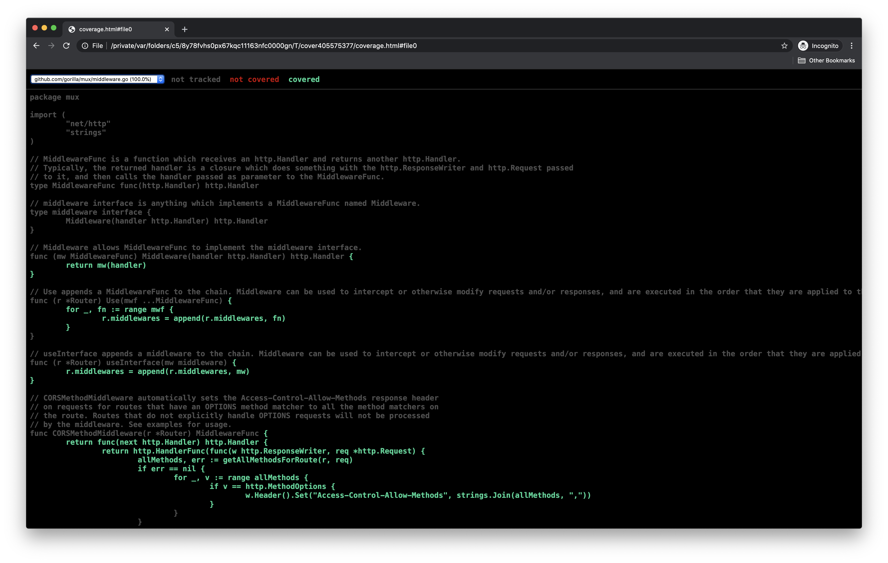
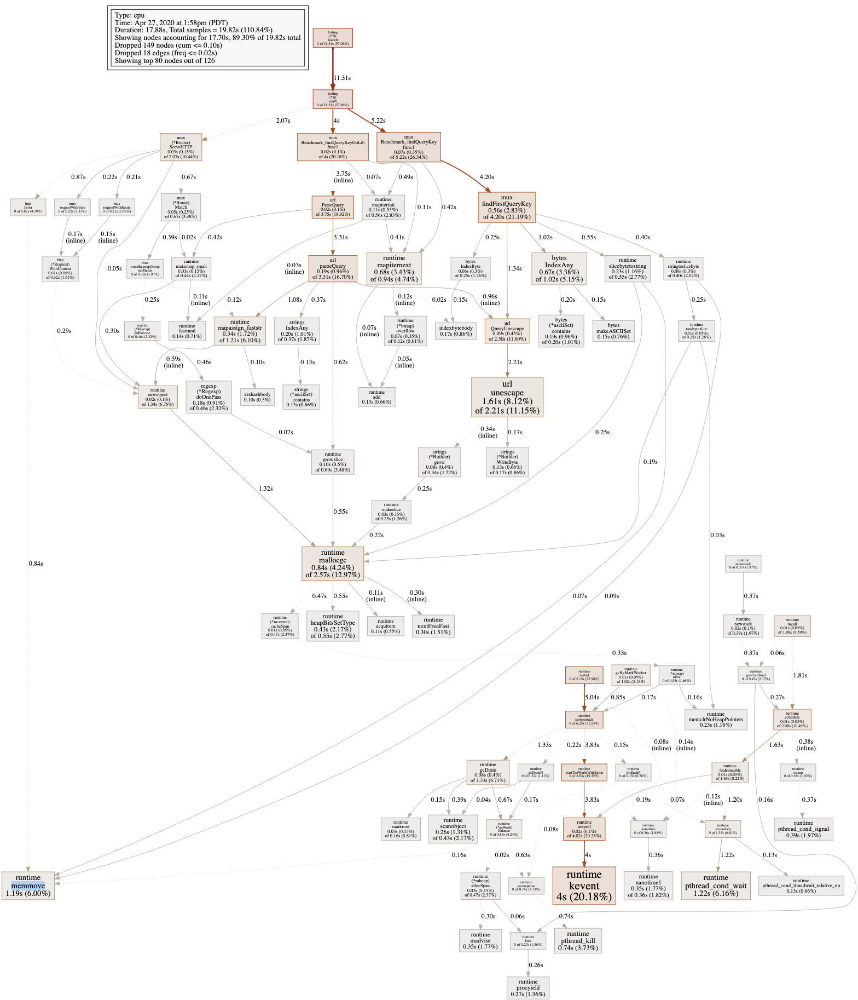
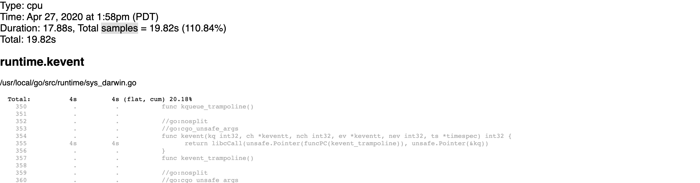
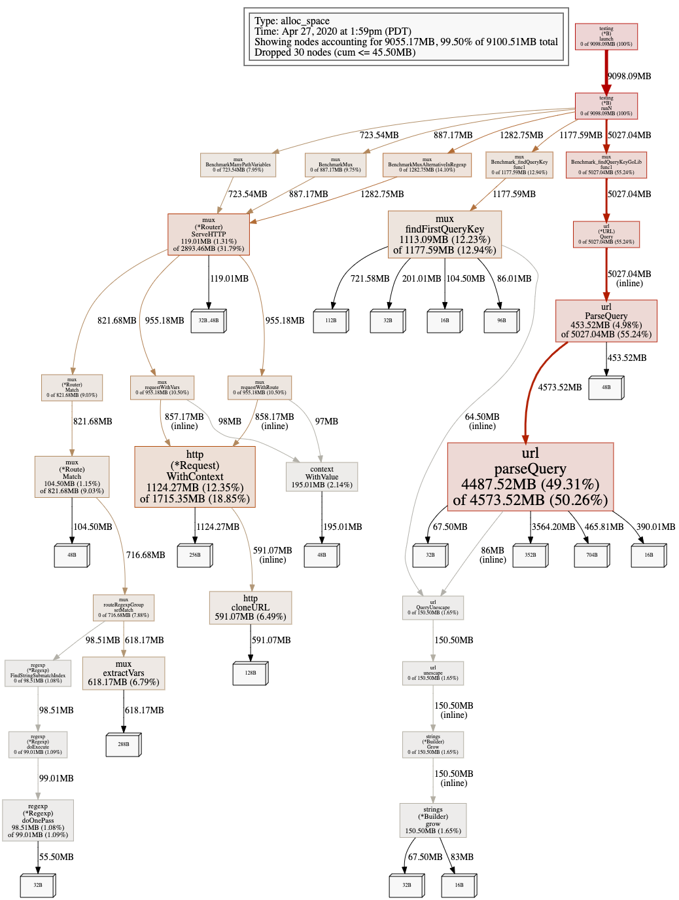
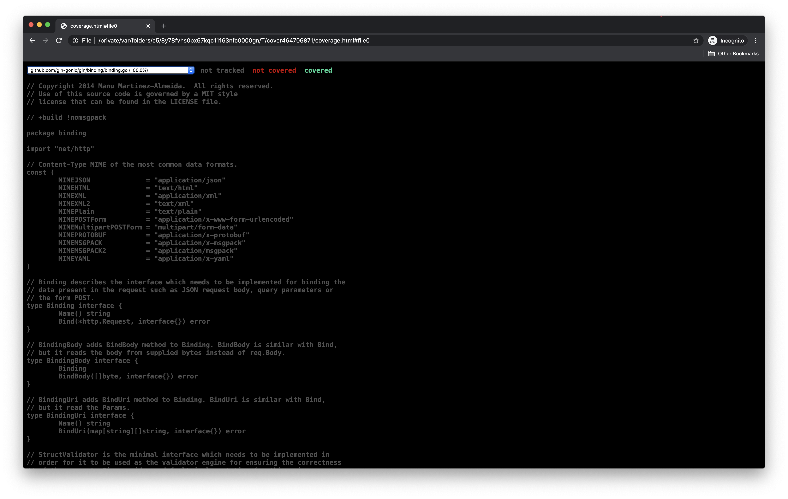
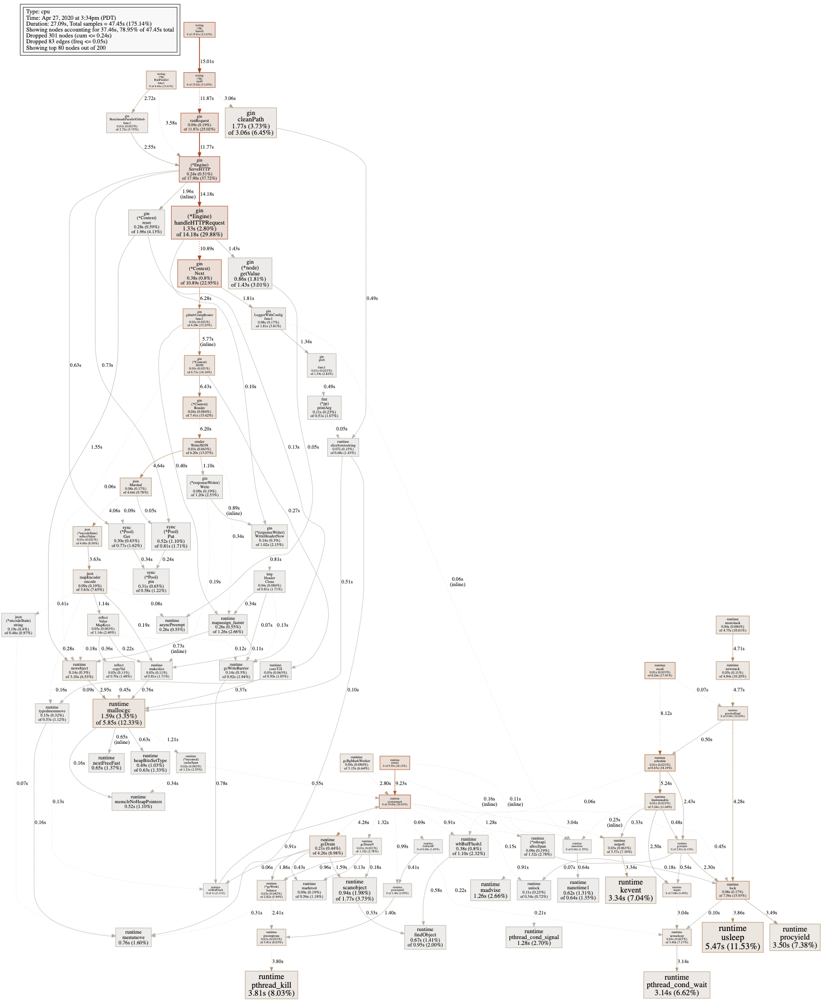
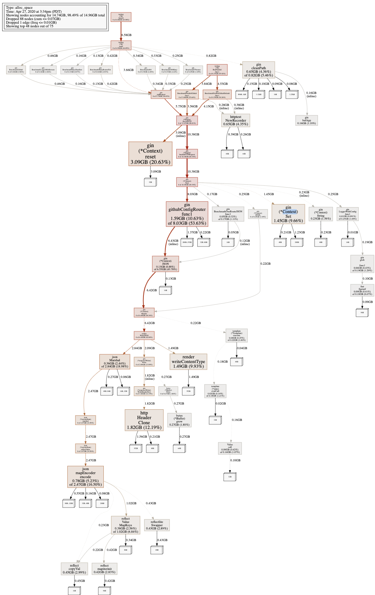
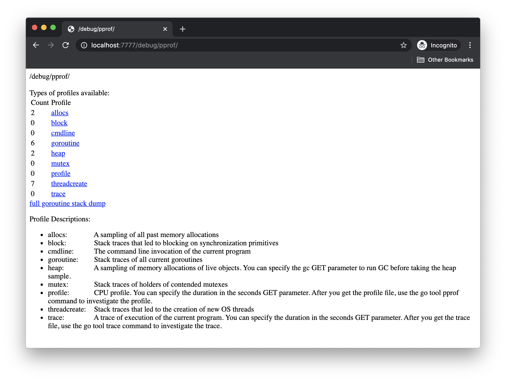

# Go


## Study of 3rd Party Frameworks - Testing and Diagnostics

In this lab we will cover some aspects of testing with Golang and related diagnostic tools. We will look at some 
popular frameworks to see how they approached these efforts. We have chosen Gorilla Mux, Gin, and CoreDNS.  

You can find more about each application here:

* Gorilla Web Toolkit Package Mux - https://github.com/gorilla/mux
* Gin Web Framework - https://gin-gonic.com/
* CoreDNS - https://coredns.io/

During this journey, we start with seeing how to execute the standard variety of Go tests including runnable, 
benchmark, and examples. You will see how a framework is wrapped, either as a package or a module, affets how we can 
execute the related commands. We then take a look at how to generate coverage maps via the available tests. This will
help us make sure we have enough code coverage in our tests. We move towards performance related matters and see how 
we can generate cpu and memory usage profiles.

Beyond the aforementioned concepts, we will then take Delve, the Go debugger for a spin, against the tests provided.

Go provided even more tools to assist in crafting performent code. In the end we see how to use the built in 'race' 
checker used for data access races (ex. 1 read 1 write at same time with no protection), ending with tracking go's 
internal events and generating core dumps.


### 1. Gorrilla Mux

Gorilla Mux (often called gorilla or mux) is often compared to the builtin Golang http request handler mechanism. Mux 
has the ability to perform more advanced routing based on query parameters and pathing out of the box. Here is the 
official description:

> Package gorilla/mux implements a request router and dispatcher for matching incoming requests to their respective handler.
> 
> The name mux stands for "HTTP request multiplexer". Like the standard http.ServeMux, mux.Router matches incoming requests against a list of registered routes and calls a handler for the route that matches the URL or other conditions. The main features are:
> 
> * It implements the http.Handler interface so it is compatible with the standard http.ServeMux.
> * Requests can be matched based on URL host, path, path prefix, schemes, header and query values, HTTP methods or using custom matchers.
> * URL hosts, paths and query values can have variables with an optional regular expression.
> * Registered URLs can be built, or "reversed", which helps maintaining references to resources.
> * Routes can be used as subrouters: nested routes are only tested if the parent route matches. This is useful to define groups of routes that share common conditions like a host, a path prefix or other repeated attributes. As a bonus, this optimizes request matching.

In these examples we are not to worried about the primary purpose of Mux (or Gin, or CoreDNS), as popular 
frameworks/programs, we like to use them guides on how to write Go code.


### 2. Installing Gorilla Mux

We start with cloning the Gorilla Mux source.

```
~$ cd ~

~$ git clone git://github.com/gorilla/mux.git

Cloning into 'mux'...
remote: Enumerating objects: 921, done.
remote: Counting objects: 100% (5/5), done.
remote: Compressing objects: 100% (5/5), done.
remote: Total 921 (delta 0), reused 4 (delta 0), pack-reused 916
Receiving objects: 100% (921/921), 448.86 KiB | 3.87 MiB/s, done.
Resolving deltas: 100% (552/552), done.

~$
```

Before running the tests, we need additional tools.

```
~$ sudo apt update

~$ sudo apt install build-essential -y

...

~$ gcc --version

gcc (Ubuntu 9.3.0-17ubuntu1~20.04) 9.3.0
Copyright (C) 2019 Free Software Foundation, Inc.
This is free software; see the source for copying conditions.  There is NO
warranty; not even for MERCHANTABILITY or FITNESS FOR A PARTICULAR PURPOSE.

~$ cd ./mux

~/mux$ ls -1F

AUTHORS
LICENSE
README.md
bench_test.go
doc.go
example_authentication_middleware_test.go
example_cors_method_middleware_test.go
example_route_test.go
go.mod
middleware.go
middleware_test.go
mux.go
mux_httpserver_test.go
mux_test.go
old_test.go
regexp.go
regexp_test.go
route.go
test_helpers.go

~/mux$ 
```

### 3. Running Tests

The following command will run "many" tests. The options in the command:

* prevent caching the tests (`--count=`)
* showing each test execution (`-v`)

```
~/mux$ go test --count=1 -v *.go

=== RUN   TestMiddlewareAdd
--- PASS: TestMiddlewareAdd (0.00s)
=== RUN   TestMiddleware
=== RUN   TestMiddleware/regular_middleware_call
=== RUN   TestMiddleware/not_called_for_404
=== RUN   TestMiddleware/not_called_for_method_mismatch
=== RUN   TestMiddleware/regular_call_using_function_middleware
--- PASS: TestMiddleware (0.00s)
    --- PASS: TestMiddleware/regular_middleware_call (0.00s)

...

    --- PASS: TestMethodsSubrouterCatchall/disallow_PUT_method (0.00s)
=== RUN   ExampleSetURLVars
--- PASS: ExampleSetURLVars (0.00s)
=== RUN   ExampleCORSMethodMiddleware
--- PASS: ExampleCORSMethodMiddleware (0.00s)
=== RUN   ExampleRoute_HeadersRegexp
--- PASS: ExampleRoute_HeadersRegexp (0.00s)
=== RUN   ExampleRoute_HeadersRegexp_exactMatch
--- PASS: ExampleRoute_HeadersRegexp_exactMatch (0.00s)
PASS
ok  	command-line-arguments	0.032s

~/mux$
```

We can now run the benchmark tests. The option `-run=XXX` will cause us to not match any other tests, `-bench=.` 
will wildcard and match all Benchmark prefix tests.

```
~/mux$ go test --count=1 -v -run=XXX -bench=.

goos: linux
goarch: amd64
pkg: github.com/gorilla/mux
cpu: Intel(R) Xeon(R) Platinum 8175M CPU @ 2.50GHz
BenchmarkMux
BenchmarkMux-2                      	  693882	      1475 ns/op
BenchmarkMuxAlternativeInRegexp
BenchmarkMuxAlternativeInRegexp-2   	  489532	      2211 ns/op

...

Benchmark_findQueryKeyGoLib/4
Benchmark_findQueryKeyGoLib/4-2     	226422517	         5.284 ns/op	       0 B/op	       0 allocs/op
PASS
ok  	github.com/gorilla/mux	18.929s

~/mux$
```

We can see if Mux provides an Example tests by filtering with `-run=Example`.

```
~/mux$ go test --count=1 -v -run=Example .

=== RUN   ExampleSetURLVars
--- PASS: ExampleSetURLVars (0.00s)
=== RUN   ExampleCORSMethodMiddleware
--- PASS: ExampleCORSMethodMiddleware (0.00s)
=== RUN   ExampleRoute_HeadersRegexp
--- PASS: ExampleRoute_HeadersRegexp (0.00s)
=== RUN   ExampleRoute_HeadersRegexp_exactMatch
--- PASS: ExampleRoute_HeadersRegexp_exactMatch (0.00s)
PASS
ok  	github.com/gorilla/mux	0.004s

~/mux$
```

Indeed it does!


### 4. Mux test code coverage

Go provides not only a test runner, but tooling to evaluate code coverage (`go tool cover`).  Take a moment a look 
at the help page.

```
~/mux$ go tool cover -help

...

```

To generate a coverage map against our test we specify `go test -coverprofile` where we save the results.

```
~/mux$ go test -coverprofile=mux.cp.out

PASS
coverage: 87.8% of statements
ok  	github.com/gorilla/mux	0.023s

~/mux$
```

Fortunately, Go provides a built in mechanism to view the restuls via `go tool cover`.

```
~/mux$ go tool cover -html=mux.cp.out

HTML output written to /tmp/cover3665509450/coverage.html

~/mux$
```

Take a moment and look around the results, including the drop down (your image will differ).




### 5. Profiling CPU

Go also provides profiling integrations. While there are a different ways to approach this, we will use the arguably 
simpliest by modifying our test comannd. We specify a capture of both a cpu profile (`-cpuprofile`) and memory 
(`-memprofile`). Notice how we limit this profiling to our bencmark related tests, we are hunting bad code afterall!

```
~/mux$ go test -cpuprofile cpu.prof -memprofile mem.prof -run=XXX -bench=.

goos: linux
goarch: amd64
pkg: github.com/gorilla/mux
cpu: Intel(R) Xeon(R) Platinum 8175M CPU @ 2.50GHz
BenchmarkMux-2                      	  663583	      1609 ns/op
BenchmarkMuxAlternativeInRegexp-2   	  480134	      2370 ns/op
BenchmarkManyPathVariables-2        	  468577	      2211 ns/op
Benchmark_findQueryKey/0-2          	 5946750	       199.9 ns/op	       0 B/op	       0 allocs/op
Benchmark_findQueryKey/1-2          	 4469578	       268.2 ns/op	      40 B/op	       3 allocs/op
Benchmark_findQueryKey/2-2          	 1000000	      1018 ns/op	     483 B/op	      10 allocs/op
Benchmark_findQueryKey/3-2          	 1062002	      1137 ns/op	     543 B/op	      11 allocs/op
Benchmark_findQueryKey/4-2          	236207972	         5.085 ns/op	       0 B/op	       0 allocs/op
Benchmark_findQueryKeyGoLib/0-2     	 1215498	       972.7 ns/op	     864 B/op	       8 allocs/op
Benchmark_findQueryKeyGoLib/1-2     	 2290401	       521.6 ns/op	     432 B/op	       4 allocs/op
Benchmark_findQueryKeyGoLib/2-2     	  358191	      3182 ns/op	    1542 B/op	      24 allocs/op
Benchmark_findQueryKeyGoLib/3-2     	  284983	      4084 ns/op	    1984 B/op	      28 allocs/op
Benchmark_findQueryKeyGoLib/4-2     	228702864	         5.233 ns/op	       0 B/op	       0 allocs/op
PASS
ok  	github.com/gorilla/mux	19.264s

~/mux$
```

While the previous listing was mostly our output of the benchmark tests, we also generated two output files, one for
the cpu profile and one for the memory profile. pprof is a well known profiling tool also used by Go, review its 
options.

```
~/mux$ go tool pprof -h

...

~/mux$
```

We can supply either profile, cpu, or memory to pprof and further analyze it (including graphically).

```
~/mux$ go tool pprof cpu.prof

File: mux.test
Type: cpu
Time: Feb 3, 2022 at 9:18pm (UTC)
Duration: 19.25s, Total samples = 21.49s (111.63%)
Entering interactive mode (type "help" for commands, "o" for options)

(pprof)
```

You can see available commands from inside pprof via `help`.

```
(pprof) help

...

(pprof)
```

Further, you can get `help` for the various subcommands.

```
(pprof) help web

Visualize graph through web browser
  Usage:
    web [n] [focus_regex]* [-ignore_regex]*
    Include up to n samples
    Include samples matching focus_regex, and exclude ignore_regex.

(pprof)
```

We can visualize our cpu utilization via the `web` command. 

> n.b This will only work if you have a supported browswer. Other browsers may work with limited functionality. If you do not have said browser, you can potentially export as a graphics file and open with a standard app.

```
(pprof) web

failed to execute dot. Is Graphviz installed? Error: exec: "dot": executable file not found in $PATH

# in another terminal, sudo apt install graphiviz -y

(pprof) web

Couldn't find a suitable web browser!

Set the BROWSER environment variable to your desired browser.

# this didn't work because we don't have a browser to open, but if this was your computer or vm with UI it would could/work

(pprof) web

(pprof) #it worked
```



Lets move to using the CLI instead.

We can analysis in pprof for example with `top`, review `top` help and then execute.

```
(pprof) help top

Outputs top entries in text form
  Usage:
    top [n] [focus_regex]* [-ignore_regex]* [-cum] >f
    Include up to n samples
    Include samples matching focus_regex, and exclude ignore_regex.
    -cum sorts the output by cumulative weight
    Optionally save the report on the file f

(pprof) top

Showing nodes accounting for 10500ms, 48.86% of 21490ms total
Dropped 218 nodes (cum <= 107.45ms)
Showing top 10 nodes out of 115
      flat  flat%   sum%        cum   cum%
    1710ms  7.96%  7.96%     5450ms 25.36%  runtime.mallocgc
    1590ms  7.40% 15.36%     2330ms 10.84%  net/url.unescape
    1150ms  5.35% 20.71%     1830ms  8.52%  runtime.mapiterinit
    1090ms  5.07% 25.78%     1340ms  6.24%  runtime.heapBitsSetType
    1020ms  4.75% 30.53%     1020ms  4.75%  runtime.duffzero
     880ms  4.09% 34.62%     7730ms 35.97%  github.com/gorilla/mux.Benchmark_findQueryKey.func1
     800ms  3.72% 38.34%     1550ms  7.21%  bytes.IndexAny
     800ms  3.72% 42.07%     1160ms  5.40%  runtime.mapiternext
     780ms  3.63% 45.70%     7980ms 37.13%  github.com/gorilla/mux.Benchmark_findQueryKeyGoLib.func1
     680ms  3.16% 48.86%      680ms  3.16%  indexbytebody
     
(pprof)
```

That `net/url.unescape` looks to be up to no good.  

Can we do anything further against the cultprit?  We can with `weblist`.

```
(pprof) help weblist

Display annotated source in a web browser
  Usage:
    weblist<func_regex|address> [-focus_regex]* [-ignore_regex]*
    Include functions matching func_regex, or including the address specified.
    Include samples matching focus_regex, and exclude ignore_regex.

(pprof)

(pprof) weblist net/url.unescape

# without UI it will not work

(pprof) exit

~/mux$ 
```

With `weblist` we see annotated source code, helping us understand why this is taking our CPU!



> N.B. An alternative to using a built-in browser is to disable that autolaunch and use the web server instead.

```
~/mux$ sudo apt install graphviz -y # needed to render image

~/mux$ go tool pprof -no_browser -http 0.0.0.0:8080 cpu.prof

Serving web UI on http://0.0.0.0:8080
```

Check your browser again on port http://VMIP:8080.

Stope (control c) when finished.


### 6. Profiling Memory

Next we review our memory utilization. We can now load our memory profile.

```
~/mux$ go tool pprof mem.prof

File: mux.test
Type: alloc_space
Time: Feb 3, 2022 at 9:18pm (UTC)
Entering interactive mode (type "help" for commands, "o" for options)

(pprof)
```

As before, we can view it graphically (or via image - ex. svg):

```
(pprof) web

# if UI available

(pprof)
```



While graphs are neat, might be faster to copy and paste from a performance based listing.  Notice wiht top, instead 
of CPU data it it Memory related.

```
(pprof) top

Showing nodes accounting for 8673.34MB, 98.32% of 8821.68MB total
Dropped 41 nodes (cum <= 44.11MB)
Showing top 10 nodes out of 28
      flat  flat%   sum%        cum   cum%
 3755.65MB 42.57% 42.57%  3845.65MB 43.59%  net/url.parseQuery
 1601.14MB 18.15% 60.72%  1673.14MB 18.97%  github.com/gorilla/mux.findFirstQueryKey
 1047.76MB 11.88% 72.60%  1645.84MB 18.66%  net/http.(*Request).WithContext (inline)
  603.17MB  6.84% 79.44%   603.17MB  6.84%  github.com/gorilla/mux.extractVars (inline)
  598.08MB  6.78% 86.22%   598.08MB  6.78%  net/http.cloneURL (inline)
  469.02MB  5.32% 91.53%  4314.67MB 48.91%  net/url.ParseQuery
  195.01MB  2.21% 93.74%   195.01MB  2.21%  context.WithValue
     162MB  1.84% 95.58%      162MB  1.84%  strings.(*Builder).grow (inline)
  125.01MB  1.42% 97.00%  2828.81MB 32.07%  github.com/gorilla/mux.(*Router).ServeHTTP
  116.51MB  1.32% 98.32%   116.51MB  1.32%  regexp.(*Regexp).doOnePass

(pprof)
```

This time, pick another funtion to dive into.

```
(pprof) weblist net/url.parseQuery

# again, you need a UI

(pprof)
```


also via terminal:

```
(pprof) list net/url.parseQuery

Total: 8.61GB
ROUTINE ======================== net/url.parseQuery in /usr/local/go/src/net/url/url.go
    3.67GB     3.76GB (flat, cum) 43.59% of Total
         .          .    928:		}
         .          .    929:		if key == "" {
         .          .    930:			continue
         .          .    931:		}
         .          .    932:		key, value, _ := strings.Cut(key, "=")
         .        3MB    933:		key, err1 := QueryUnescape(key)
         .          .    934:		if err1 != nil {
         .          .    935:			if err == nil {
         .          .    936:				err = err1
         .          .    937:			}
         .          .    938:			continue
         .          .    939:		}
         .       87MB    940:		value, err1 = QueryUnescape(value)
         .          .    941:		if err1 != nil {
         .          .    942:			if err == nil {
         .          .    943:				err = err1
         .          .    944:			}
         .          .    945:			continue
         .          .    946:		}
    3.67GB     3.67GB    947:		m[key] = append(m[key], value)
         .          .    948:	}
         .          .    949:	return err
         .          .    950:}
         .          .    951:
         .          .    952:// Encode encodes the values into ``URL encoded'' form


(pprof) exit

~/mux$
```


#### Challenge

Now that you have some basic command and control testing and profiling:

* Find another test (maybe aside benchmark) or another function to analyze
* Try other options with these tools


### 7. Gin

Per https://gin-gonic.com/

> Gin is a web framework written in Golang. It features a Martini-like API, but with performance up to 40 times faster
than Martini. If you need performance and good productivity, you will love Gin.

Mux may be the 800-lb Gorilla, Gin is running circles around it. Both fill similar roles, and for us, it is a point to 
contrast against. While we proceed with similar steps as we did with Mux, start to look for differences (ex. file 
structure, number of tests, focus of tests, etc.)


### 8. Installing Gin

```
~/mux$ cd ~

~$ git clone https://github.com/gin-gonic/gin.git

Cloning into 'gin'...
remote: Enumerating objects: 6471, done.
remote: Counting objects: 100% (50/50), done.
remote: Compressing objects: 100% (38/38), done.
remote: Total 6471 (delta 19), reused 36 (delta 12), pack-reused 6421
Receiving objects: 100% (6471/6471), 2.67 MiB | 13.49 MiB/s, done.
Resolving deltas: 100% (4007/4007), done.

~$ cd ~/gin/

~/gin$ 
```

Seems like Gin has a few friends.


### 9. Running Tests

```
~/gin$ go test --count=1 -v

go: downloading github.com/gin-contrib/sse v0.1.0
go: downloading github.com/mattn/go-isatty v0.0.14
go: downloading github.com/stretchr/testify v1.7.0
go: downloading google.golang.org/protobuf v1.27.1
go: downloading github.com/go-playground/validator/v10 v10.10.0
go: downloading github.com/ugorji/go/codec v1.2.6
go: downloading github.com/ugorji/go v1.2.6
go: downloading golang.org/x/sys v0.0.0-20210806184541-e5e7981a1069
go: downloading github.com/davecgh/go-spew v1.1.1
go: downloading github.com/pmezard/go-difflib v1.0.0
go: downloading gopkg.in/yaml.v3 v3.0.0-20210107192922-496545a6307b
go: downloading github.com/go-playground/universal-translator v0.18.0
go: downloading github.com/leodido/go-urn v1.2.1
go: downloading golang.org/x/crypto v0.0.0-20210711020723-a769d52b0f97
go: downloading golang.org/x/text v0.3.6
go: downloading github.com/go-playground/locales v0.14.0
=== RUN   TestBasicAuth
--- PASS: TestBasicAuth (0.00s)

...

=== RUN   TestFunctionName
--- PASS: TestFunctionName (0.00s)
=== RUN   TestJoinPaths
--- PASS: TestJoinPaths (0.00s)
=== RUN   TestBindMiddleware
--- PASS: TestBindMiddleware (0.00s)
=== RUN   TestMarshalXMLforH
--- PASS: TestMarshalXMLforH (0.00s)
PASS
ok  	github.com/gin-gonic/gin	0.319s

~/gin$
```

In the past, tests may have their own dependencies and you would need to download them with the '-t' flag of `go get`.

```
~/gin$ go get -v -t 

go: downloading github.com/goccy/go-json v0.9.0
go: downloading github.com/json-iterator/go v1.1.12
go: downloading github.com/modern-go/concurrent v0.0.0-20180228061459-e0a39a4cb421
go: downloading github.com/modern-go/reflect2 v1.0.2

~/gin$
```

Retry to run the tests.

```
~/gin$ go test --count=1 -v

...

=== RUN   TestFunctionName
--- PASS: TestFunctionName (0.00s)
=== RUN   TestJoinPaths
--- PASS: TestJoinPaths (0.00s)
=== RUN   TestBindMiddleware
--- PASS: TestBindMiddleware (0.00s)
=== RUN   TestMarshalXMLforH
--- PASS: TestMarshalXMLforH (0.00s)
PASS
ok  	github.com/gin-gonic/gin	0.366s

~/gin$
```

For now, do not worry about any failed tests (that would require knowing Gin).  

Lets move on to benchmarks.

```
~/gin$ go test --count=1 -v -run=XXX -bench=.

goos: linux
goarch: amd64
pkg: github.com/gin-gonic/gin
cpu: Intel(R) Xeon(R) Platinum 8175M CPU @ 2.50GHz
BenchmarkOneRoute
BenchmarkOneRoute-2                	24409018	        49.54 ns/op	       0 B/op	       0 allocs/op
BenchmarkRecoveryMiddleware
BenchmarkRecoveryMiddleware-2      	20217231	        59.12 ns/op	       0 B/op	       0 allocs/op
BenchmarkLoggerMiddleware
BenchmarkLoggerMiddleware-2        	  753426	      1588 ns/op	     220 B/op	       8 allocs/op
BenchmarkManyHandlers

...

BenchmarkPathClean
BenchmarkPathClean-2               	  883063	      1291 ns/op	     112 B/op	      17 allocs/op
BenchmarkPathCleanLong
BenchmarkPathCleanLong-2           	     204	   5823386 ns/op	 3217360 B/op	    4683 allocs/op
BenchmarkParseAccept
BenchmarkParseAccept-2             	 4162478	       285.8 ns/op
PASS
ok  	github.com/gin-gonic/gin	25.916s


~/gin$
```

Compared to (Gorilla) Mux, which framework has more benchmark tests? How do you find out how many there are? As before,
do they have any Examples to run?

```
~/gin$ go test --count=1 -v -run=Example

testing: warning: no tests to run
PASS
ok  	github.com/gin-gonic/gin	0.009s

~/gin$
```

Looks like they could use some examples!


### 10. Gin test coverage

Lets generate code coverage for Gin (be sure to change the profile output name).

```
~/gin$ go test -coverprofile=gin.cp.out

2022/02/03 21:32:22 The AppEngine flag is going to be deprecated. Please check issues #2723 and #2739 and use 'TrustedPlatform: gin.PlatformGoogleAppEngine' instead.
[GIN] 2022/02/03 - 21:32:22 | 200 |       1.495µs |       192.0.2.1 | GET      "/name1/api"
[GIN] 2022/02/03 - 21:32:22 | 200 |        6.57µs |       192.0.2.1 | GET      "/name2/api"
[GIN] 2022/02/03 - 21:32:22 | 200 |      12.839µs |       192.0.2.1 | GET      "/test/copy/race"
PASS
coverage: 99.2% of statements
ok  	github.com/gin-gonic/gin	0.343s

~/gin$ ls -l ./gin.cp.out

-rw-rw-r-- 1 ubuntu ubuntu 48803 Feb  3 21:32 ./gin.cp.out

~/gin$
```

The aforementioned error is a failed test, notice it does not prevent us from generating coverage reports.

```
~/gin$ go tool cover -html=gin.cp.out

HTML output written to /tmp/cover4154222103/coverage.html

~/gin$
```




### 11. Profiling CPU

```
~/gin$ go test -cpuprofile gin.cpu.prof -memprofile gin.mem.prof -run=XXX -bench=.

goos: linux
goarch: amd64
pkg: github.com/gin-gonic/gin
cpu: Intel(R) Xeon(R) Platinum 8175M CPU @ 2.50GHz
BenchmarkOneRoute-2                	24322405	        50.29 ns/op	       0 B/op	       0 allocs/op
BenchmarkRecoveryMiddleware-2      	19621782	        60.96 ns/op	       0 B/op	       0 allocs/op
BenchmarkLoggerMiddleware-2        	  703938	      1617 ns/op	     220 B/op	       8 allocs/op
BenchmarkManyHandlers-2            	  723259	      1684 ns/op	     220 B/op	       8 allocs/op
Benchmark5Params-2                 	 9805801	       123.1 ns/op	       0 B/op	       0 allocs/op
BenchmarkOneRouteJSON-2            	 3169436	       373.1 ns/op	      48 B/op	       3 allocs/op
BenchmarkOneRouteHTML-2            	  867110	      1387 ns/op	     256 B/op	       9 allocs/op
BenchmarkOneRouteSet-2             	 3240710	       378.5 ns/op	     336 B/op	       2 allocs/op
BenchmarkOneRouteString-2          	 6843162	       173.0 ns/op	      48 B/op	       1 allocs/op
BenchmarkManyRoutesFist-2          	24050334	        52.53 ns/op	       0 B/op	       0 allocs/op
BenchmarkManyRoutesLast-2          	22769410	        55.58 ns/op	       0 B/op	       0 allocs/op
Benchmark404-2                     	16588263	        70.93 ns/op	       0 B/op	       0 allocs/op
Benchmark404Many-2                 	14382057	        83.82 ns/op	       0 B/op	       0 allocs/op
BenchmarkGithub-2                  	  389052	      2982 ns/op	    1208 B/op	      19 allocs/op
BenchmarkParallelGithub-2          	  337125	      3289 ns/op
BenchmarkParallelGithubDefault-2   	  338553	      3299 ns/op
BenchmarkPathClean-2               	  891072	      1297 ns/op	     112 B/op	      17 allocs/op
BenchmarkPathCleanLong-2           	     211	   5772493 ns/op	 3217360 B/op	    4683 allocs/op
BenchmarkParseAccept-2             	 3976125	       296.6 ns/op
PASS
ok  	github.com/gin-gonic/gin	25.419s

~/gin$
```

Lets try another package `bytesconv`, notice it is nested (and special, under *interal*).

```
~/gin$ go test -cpuprofile gin.cpu.prof -memprofile gin.mem.prof -run=XXX -bench=. ./internal/bytesconv/

goos: linux
goarch: amd64
pkg: github.com/gin-gonic/gin/internal/bytesconv
cpu: Intel(R) Xeon(R) Platinum 8175M CPU @ 2.50GHz
BenchmarkBytesConvBytesToStrRaw-2   	28062651	        39.71 ns/op
BenchmarkBytesConvBytesToStr-2      	1000000000	         0.3346 ns/op
BenchmarkBytesConvStrToBytesRaw-2   	25699833	        46.61 ns/op
BenchmarkBytesConvStrToBytes-2      	1000000000	         0.3256 ns/op
PASS
ok  	github.com/gin-gonic/gin/internal/bytesconv	3.317s

~/gin$
```

Before proceding, lets run the `gin` pacakge one more as it is more interesting (to update gin.cpu.prof).

```
~/gin$ go test -cpuprofile gin.cpu.prof -memprofile gin.mem.prof -run=XXX -bench=.

goos: linux
goarch: amd64
pkg: github.com/gin-gonic/gin
cpu: Intel(R) Xeon(R) Platinum 8175M CPU @ 2.50GHz
BenchmarkOneRoute-2                	23868882	        49.27 ns/op	       0 B/op	       0 allocs/op
BenchmarkRecoveryMiddleware-2      	20324604	        59.35 ns/op	       0 B/op	       0 allocs/op
BenchmarkLoggerMiddleware-2        	  702055	      1614 ns/op	     220 B/op	       8 allocs/op
BenchmarkManyHandlers-2            	  725458	      1688 ns/op	     220 B/op	       8 allocs/op
Benchmark5Params-2                 	 9777728	       122.4 ns/op	       0 B/op	       0 allocs/op
BenchmarkOneRouteJSON-2            	 3133152	       382.2 ns/op	      48 B/op	       3 allocs/op
BenchmarkOneRouteHTML-2            	  844603	      1395 ns/op	     256 B/op	       9 allocs/op
BenchmarkOneRouteSet-2             	 3141603	       377.0 ns/op	     336 B/op	       2 allocs/op
BenchmarkOneRouteString-2          	 6775815	       176.1 ns/op	      48 B/op	       1 allocs/op
BenchmarkManyRoutesFist-2          	22859314	        49.14 ns/op	       0 B/op	       0 allocs/op
BenchmarkManyRoutesLast-2          	22456874	        54.55 ns/op	       0 B/op	       0 allocs/op
Benchmark404-2                     	16194538	        70.88 ns/op	       0 B/op	       0 allocs/op
Benchmark404Many-2                 	14397609	        83.31 ns/op	       0 B/op	       0 allocs/op
BenchmarkGithub-2                  	  365104	      3031 ns/op	    1208 B/op	      19 allocs/op
BenchmarkParallelGithub-2          	  339804	      3303 ns/op
BenchmarkParallelGithubDefault-2   	  340507	      3281 ns/op
BenchmarkPathClean-2               	  932940	      1299 ns/op	     112 B/op	      17 allocs/op
BenchmarkPathCleanLong-2           	     205	   5802454 ns/op	 3217399 B/op	    4683 allocs/op
BenchmarkParseAccept-2             	 3949646	       299.7 ns/op
PASS
ok  	github.com/gin-gonic/gin	25.189s

~/gin$ go tool pprof gin.cpu.prof

File: gin.test
Type: cpu
Time: Feb 3, 2022 at 9:34pm (UTC)
Duration: 25.16s, Total samples = 30.08s (119.54%)
Entering interactive mode (type "help" for commands, "o" for options)

(pprof) web

# ui required

(pprof)
```



```
(pprof) top

Showing nodes accounting for 12460ms, 41.42% of 30080ms total
Dropped 293 nodes (cum <= 150.40ms)
Showing top 10 nodes out of 188
      flat  flat%   sum%        cum   cum%
    2770ms  9.21%  9.21%    17990ms 59.81%  github.com/gin-gonic/gin.(*Engine).handleHTTPRequest
    1710ms  5.68% 14.89%     2300ms  7.65%  github.com/gin-gonic/gin.(*node).getValue
    1640ms  5.45% 20.35%     5790ms 19.25%  runtime.mallocgc
    1290ms  4.29% 24.63%     2840ms  9.44%  github.com/gin-gonic/gin.cleanPath
    1140ms  3.79% 28.42%     2470ms  8.21%  runtime.scanobject
    1130ms  3.76% 32.18%     1340ms  4.45%  runtime.heapBitsSetType
     780ms  2.59% 34.77%      920ms  3.06%  github.com/gin-gonic/gin.bufApp
     740ms  2.46% 37.23%      920ms  3.06%  github.com/gin-gonic/gin.(*Context).reset
     670ms  2.23% 39.46%    21830ms 72.57%  github.com/gin-gonic/gin.(*Engine).ServeHTTP
     590ms  1.96% 41.42%     1250ms  4.16%  sync.(*Pool).Put

(pprof) exit

~/gin$
```


* Using `list`, review your top offending code
  * ex. `list github.com/gin-gonic/gin.\(\*Engine\).handleHTTPRequest`
  * n.b. be sure to escape parens and asteriks


### 12. Profiling Memory

As before, exit pprof, then load our memory profile.

```
~/gin$ go tool pprof ./gin.mem.prof

File: gin.test
Type: alloc_space
Time: Feb 3, 2022 at 9:34pm (UTC)
Entering interactive mode (type "help" for commands, "o" for options)

(pprof)
```

Review visually.

```
(pprof) web

# ui required

(pprof)
```



Hunt poor performing functions with `top` and drill into them with `weblist`. Notice below we try the top `top` 
function, however no code is available for it as we only deployed via testing, pick another one.

```
(pprof) top

Showing nodes accounting for 4486.49MB, 77.02% of 5825.07MB total
Dropped 58 nodes (cum <= 29.13MB)
Showing top 10 nodes out of 80
      flat  flat%   sum%        cum   cum%
 1349.83MB 23.17% 23.17%  1349.83MB 23.17%  github.com/gin-gonic/gin.(*Context).Set
  821.60MB 14.10% 37.28%  1068.31MB 18.34%  github.com/gin-gonic/gin.cleanPath
  365.02MB  6.27% 43.54%   365.02MB  6.27%  github.com/gin-gonic/gin.(*Context).String
  321.58MB  5.52% 49.06%  1603.33MB 27.52%  github.com/gin-gonic/gin.githubConfigRouter.func1
  304.02MB  5.22% 54.28%   304.02MB  5.22%  strings.genSplit
  290.52MB  4.99% 59.27%   594.54MB 10.21%  github.com/gin-gonic/gin.parseAccept
  280.58MB  4.82% 64.09%   280.58MB  4.82%  net/http.Header.Clone (inline)
  271.06MB  4.65% 68.74%   641.08MB 11.01%  encoding/json.mapEncoder.encode
  246.71MB  4.24% 72.98%   246.71MB  4.24%  github.com/gin-gonic/gin.bufApp (inline)
  235.58MB  4.04% 77.02%   235.58MB  4.04%  github.com/gin-gonic/gin/render.writeContentType

(pprof) list github.com/gin-gonic/gin.\(\*Context\).Set

Total: 5.69GB
ROUTINE ======================== github.com/gin-gonic/gin.(*Context).Set in /home/ubuntu/gin/context.go
    1.32GB     1.32GB (flat, cum) 23.17% of Total
         .          .    242:// Set is used to store a new key/value pair exclusively for this context.
         .          .    243:// It also lazy initializes  c.Keys if it was not used previously.
         .          .    244:func (c *Context) Set(key string, value interface{}) {
         .          .    245:	c.mu.Lock()
         .          .    246:	if c.Keys == nil {
  192.01MB   192.01MB    247:		c.Keys = make(map[string]interface{})
         .          .    248:	}
         .          .    249:
    1.13GB     1.13GB    250:	c.Keys[key] = value
         .          .    251:	c.mu.Unlock()
         .          .    252:}
         .          .    253:
         .          .    254:// Get returns the value for the given key, ie: (value, true).
         .          .    255:// If the value does not exist it returns (nil, false)

(pprof)
```


* Review the second or third offender!

```
(pprof) exit

~/gin$ 
```


#### Challenge

Now that we have tools to compare frameworks, try to find similar functions in mux and gin, try to compare, maybe make 
your own tests?


### 13. CoreDNS

Per https://coredns.io/

> CoreDNS is a DNS server.

We will leave it at that, except, Kubernetes uses CoreDNS (via kube-dns) as its default DNS offering. As before, we are
not looking at its purpose here, as a popular tool, we like to see how we can study it.


### 14. Installing Coredns

```
~/gin$ cd ~

~$ git clone https://github.com/coredns/coredns

Cloning into 'coredns'...
remote: Enumerating objects: 60957, done.
remote: Counting objects: 100% (174/174), done.
remote: Compressing objects: 100% (122/122), done.
remote: Total 60957 (delta 100), reused 93 (delta 50), pack-reused 60783
Receiving objects: 100% (60957/60957), 97.28 MiB | 19.74 MiB/s, done.
Resolving deltas: 100% (33756/33756), done.

~$ cd ~/coredns/

~/coredns$
```

### 15. Running tests

Practice makes perfect, lets run all the available tests in the primary package. More so than other packages, coredns
 has nested tests, to hit them, use "./...".

```
~/coredns$ go test --count=1 -v ./...

... download alot ...

?   	github.com/coredns/coredns	[no test files]
?   	github.com/coredns/coredns/core	[no test files]
=== RUN   TestSplitProtocolHostPort
--- PASS: TestSplitProtocolHostPort (0.00s)
=== RUN   TestOverlapAddressChecker
--- PASS: TestOverlapAddressChecker (0.00s)
=== RUN   TestHandler
--- PASS: TestHandler (0.00s)
=== RUN   TestHandlers
--- PASS: TestHandlers (0.00s)
=== RUN   TestGroupingServers
--- PASS: TestGroupingServers (0.00s)

...

=== CONT  TestLookupDS
--- PASS: TestLookupDS (0.00s)
=== CONT  TestZoneExternalCNAMELookupWithoutProxy
--- PASS: TestZoneExternalCNAMELookupWithoutProxy (0.00s)
=== CONT  TestAutoAXFR
--- PASS: TestAutoAXFR (0.05s)
=== CONT  TestAutoNonExistentZone
--- PASS: TestAutoNonExistentZone (0.00s)
--- PASS: TestAuto (0.10s)
PASS
ok  	github.com/coredns/coredns/test	3.280s

~/coredns$
```

Like any software, Coredns has dependencies, take a look at the go.mod to get a feel for what it depends on.

```
~/coredns$ cat go.mod 

module github.com/coredns/coredns

go 1.17

require (
	github.com/Azure/azure-sdk-for-go v61.4.0+incompatible
	github.com/Azure/go-autorest/autorest v0.11.24
	github.com/Azure/go-autorest/autorest/azure/auth v0.5.11
	github.com/apparentlymart/go-cidr v1.1.0
	github.com/aws/aws-sdk-go v1.42.44
	github.com/coredns/caddy v1.1.1
	github.com/dnstap/golang-dnstap v0.4.0
	github.com/farsightsec/golang-framestream v0.3.0
	github.com/golang/protobuf v1.5.2
	github.com/grpc-ecosystem/grpc-opentracing v0.0.0-20180507213350-8e809c8a8645
	github.com/infobloxopen/go-trees v0.0.0-20200715205103-96a057b8dfb9
	github.com/matttproud/golang_protobuf_extensions v1.0.1
	github.com/miekg/dns v1.1.45
	github.com/opentracing/opentracing-go v1.2.0
	github.com/openzipkin-contrib/zipkin-go-opentracing v0.4.5
	github.com/openzipkin/zipkin-go v0.4.0
	github.com/oschwald/geoip2-golang v1.6.1
	github.com/prometheus/client_golang v1.12.1
	github.com/prometheus/client_model v0.2.0
	github.com/prometheus/common v0.32.1
	go.etcd.io/etcd/api/v3 v3.5.1
	go.etcd.io/etcd/client/v3 v3.5.1
	golang.org/x/crypto v0.0.0-20211215153901-e495a2d5b3d3
	golang.org/x/sys v0.0.0-20220114195835-da31bd327af9
	google.golang.org/api v0.66.0
	google.golang.org/grpc v1.44.0
	gopkg.in/DataDog/dd-trace-go.v1 v1.36.0
	k8s.io/api v0.23.3
	k8s.io/apimachinery v0.23.3
	k8s.io/client-go v0.23.3
	k8s.io/klog/v2 v2.40.1
)

require (
	cloud.google.com/go/compute v0.1.0 // indirect
	github.com/Azure/go-autorest v14.2.0+incompatible // indirect
	github.com/Azure/go-autorest/autorest/adal v0.9.18 // indirect
	github.com/Azure/go-autorest/autorest/azure/cli v0.4.5 // indirect
	github.com/Azure/go-autorest/autorest/date v0.3.0 // indirect
	github.com/Azure/go-autorest/autorest/to v0.2.0 // indirect
	github.com/Azure/go-autorest/logger v0.2.1 // indirect
	github.com/Azure/go-autorest/tracing v0.6.0 // indirect
	github.com/DataDog/datadog-agent/pkg/obfuscate v0.0.0-20211129110424-6491aa3bf583 // indirect
	github.com/DataDog/datadog-go v4.8.2+incompatible // indirect
	github.com/DataDog/datadog-go/v5 v5.0.2 // indirect
	github.com/DataDog/sketches-go v1.0.0 // indirect
	github.com/Microsoft/go-winio v0.5.1 // indirect
	github.com/beorn7/perks v1.0.1 // indirect
	github.com/cespare/xxhash/v2 v2.1.2 // indirect
	github.com/coreos/go-semver v0.3.0 // indirect
	github.com/coreos/go-systemd/v22 v22.3.2 // indirect
	github.com/davecgh/go-spew v1.1.1 // indirect
	github.com/dgraph-io/ristretto v0.1.0 // indirect
	github.com/dimchansky/utfbom v1.1.1 // indirect
	github.com/dustin/go-humanize v1.0.0 // indirect
	github.com/evanphx/json-patch v4.12.0+incompatible // indirect
	github.com/flynn/go-shlex v0.0.0-20150515145356-3f9db97f8568 // indirect
	github.com/go-logr/logr v1.2.0 // indirect
	github.com/gogo/protobuf v1.3.2 // indirect
	github.com/golang-jwt/jwt/v4 v4.2.0 // indirect
	github.com/golang/glog v0.0.0-20160126235308-23def4e6c14b // indirect
	github.com/golang/groupcache v0.0.0-20210331224755-41bb18bfe9da // indirect
	github.com/google/go-cmp v0.5.6 // indirect
	github.com/google/gofuzz v1.2.0 // indirect
	github.com/google/uuid v1.3.0 // indirect
	github.com/googleapis/gax-go/v2 v2.1.1 // indirect
	github.com/googleapis/gnostic v0.5.5 // indirect
	github.com/imdario/mergo v0.3.12 // indirect
	github.com/jmespath/go-jmespath v0.4.0 // indirect
	github.com/josharian/intern v1.0.0 // indirect
	github.com/json-iterator/go v1.1.12 // indirect
	github.com/mailru/easyjson v0.7.7 // indirect
	github.com/mitchellh/go-homedir v1.1.0 // indirect
	github.com/modern-go/concurrent v0.0.0-20180306012644-bacd9c7ef1dd // indirect
	github.com/modern-go/reflect2 v1.0.2 // indirect
	github.com/opentracing-contrib/go-observer v0.0.0-20170622124052-a52f23424492 // indirect
	github.com/oschwald/maxminddb-golang v1.8.0 // indirect
	github.com/philhofer/fwd v1.1.1 // indirect
	github.com/pkg/errors v0.9.1 // indirect
	github.com/prometheus/procfs v0.7.3 // indirect
	github.com/spf13/pflag v1.0.5 // indirect
	github.com/stretchr/objx v0.2.0 // indirect
	github.com/tinylib/msgp v1.1.2 // indirect
	go.etcd.io/etcd/client/pkg/v3 v3.5.1 // indirect
	go.opencensus.io v0.23.0 // indirect
	go.uber.org/atomic v1.7.0 // indirect
	go.uber.org/multierr v1.6.0 // indirect
	go.uber.org/zap v1.17.0 // indirect
	golang.org/x/mod v0.4.2 // indirect
	golang.org/x/net v0.0.0-20211216030914-fe4d6282115f // indirect
	golang.org/x/oauth2 v0.0.0-20211104180415-d3ed0bb246c8 // indirect
	golang.org/x/term v0.0.0-20210615171337-6886f2dfbf5b // indirect
	golang.org/x/text v0.3.7 // indirect
	golang.org/x/time v0.0.0-20211116232009-f0f3c7e86c11 // indirect
	golang.org/x/tools v0.1.6-0.20210726203631-07bc1bf47fb2 // indirect
	golang.org/x/xerrors v0.0.0-20200804184101-5ec99f83aff1 // indirect
	google.golang.org/appengine v1.6.7 // indirect
	google.golang.org/genproto v0.0.0-20220114231437-d2e6a121cae0 // indirect
	google.golang.org/protobuf v1.27.1 // indirect
	gopkg.in/inf.v0 v0.9.1 // indirect
	gopkg.in/yaml.v2 v2.4.0 // indirect
	gopkg.in/yaml.v3 v3.0.0-20210107192922-496545a6307b // indirect
	k8s.io/kube-openapi v0.0.0-20211115234752-e816edb12b65 // indirect
	k8s.io/utils v0.0.0-20211116205334-6203023598ed // indirect
	sigs.k8s.io/json v0.0.0-20211020170558-c049b76a60c6 // indirect
	sigs.k8s.io/structured-merge-diff/v4 v4.2.1 // indirect
	sigs.k8s.io/yaml v1.2.0 // indirect
)

~/coredns$
```

In order to download module depedencies we need to be in the actual directory where the module lives unlike before 
when using package only tooling.

Go tools understand modules, and in turn try to keep things up to date.  One tool is to simply list the module 
dependenies `go list -m`.

```
~/coredns$ go list -u -m all

...

gopkg.in/yaml.v3 v3.0.0-20210107192922-496545a6307b
honnef.co/go/tools v0.0.1-2020.1.4 [v0.2.2]
k8s.io/api v0.23.3
k8s.io/apimachinery v0.23.3
k8s.io/client-go v0.23.3
k8s.io/gengo v0.0.0-20210813121822-485abfe95c7c [v0.0.0-20211129171323-c02415ce4185]
k8s.io/klog/v2 v2.40.1
k8s.io/kube-openapi v0.0.0-20211115234752-e816edb12b65 [v0.0.0-20220124234850-424119656bbf]
k8s.io/utils v0.0.0-20211116205334-6203023598ed [v0.0.0-20220127004650-9b3446523e65]
rsc.io/binaryregexp v0.2.0
rsc.io/quote/v3 v3.1.0
rsc.io/sampler v1.3.0 [v1.99.99]
sigs.k8s.io/json v0.0.0-20211020170558-c049b76a60c6 [v0.0.0-20211208200746-9f7c6b3444d2]
sigs.k8s.io/structured-merge-diff/v4 v4.2.1
sigs.k8s.io/yaml v1.2.0 [v1.3.0]

~/coredns$
```


### 16. Test coverage

Try running `go test -coverprofile=coredns.cp.out ./...`, because of nesting it is more interesting to look at (and
 challenge to leverage this knowledge).

```
~/coredns$ go test -coverprofile=coredns.cp.out ./...

?   	github.com/coredns/coredns	[no test files]
?   	github.com/coredns/coredns/core	[no test files]
ok  	github.com/coredns/coredns/core/dnsserver	0.009s	coverage: 31.5% of statements
?   	github.com/coredns/coredns/core/plugin	[no test files]
?   	github.com/coredns/coredns/coremain	[no test files]
?   	github.com/coredns/coredns/pb	[no test files]
ok  	github.com/coredns/coredns/plugin	0.016s	coverage: 10.0% of statements
ok  	github.com/coredns/coredns/plugin/acl	0.010s	coverage: 96.6% of statements
ok  	github.com/coredns/coredns/plugin/any	0.010s	coverage: 53.3% of statements

...

ok  	github.com/coredns/coredns/plugin/test	0.008s	coverage: 2.0% of statements
ok  	github.com/coredns/coredns/plugin/tls	0.009s	coverage: 91.9% of statements
ok  	github.com/coredns/coredns/plugin/trace	0.009s	coverage: 76.5% of statements
ok  	github.com/coredns/coredns/plugin/transfer	0.008s	coverage: 68.6% of statements
ok  	github.com/coredns/coredns/plugin/whoami	0.007s	coverage: 93.5% of statements
ok  	github.com/coredns/coredns/request	0.206s	coverage: 39.5% of statements
ok  	github.com/coredns/coredns/test	3.249s	coverage: 92.0% of statements

~/coredns$ 
```


### 17. Profiling 

Try capturing cpu and memory profiles from the module (project home) directory.

```
~/coredns$ go test -cpuprofile coredns.cpu.prof -memprofile coredns.mem.prof -run=XXX -bench=. .

cannot use -cpuprofile flag with multiple packages

~/coredns$
```

We need to limit our profiling to a single package (excluding `main` and `_test` packages).

```
~/coredns$ ~/coredns$ grep -nr "^package " . | awk '{print $2}'  | sort | uniq -c | sort -nr

     49 test
     35 kubernetes
     35 file
     18 forward
     17 cache
     16 rewrite
     16 dnssec
     15 dnsserver
     13 sign
     11 etcd

...

      2 coremain
      2 cidr
      1 upstream
      1 transport
      1 rrutil
      1 pb
      1 fuzz
      1 deprecated
      1 coredns.dns;
      1 core

~/coredns$
```

Looks like coredns is a lot more complex than mux or gin.  As befor pick package and try to profile it. 

We will try `core`, sounds important:

```
~/coredns$ go test -cpuprofile coredns.cpu.prof -memprofile coredns.mem.prof -run=XXX -bench=. ./core/

?   	github.com/coredns/coredns/core	[no test files]

~/coredns$
```

Looks like we need to find the benchmarks, apparently they are no benchmarks in the core test package. We can run all
benchmarks as follows (versus finding one of them).

```
~/coredns$ go test -run=XXX -bench=. ./...

?   	github.com/coredns/coredns	[no test files]
?   	github.com/coredns/coredns/core	[no test files]
goos: linux
goarch: amd64
pkg: github.com/coredns/coredns/core/dnsserver
cpu: Intel(R) Xeon(R) Platinum 8175M CPU @ 2.50GHz
BenchmarkCoreServeDNS-2   	 4611247	       256.7 ns/op	      24 B/op	       1 allocs/op
PASS
ok  	github.com/coredns/coredns/core/dnsserver	1.492s
?   	github.com/coredns/coredns/core/plugin	[no test files]
?   	github.com/coredns/coredns/coremain	[no test files]
?   	github.com/coredns/coredns/pb	[no test files]
PASS
ok  	github.com/coredns/coredns/plugin	0.010s

...

ok  	github.com/coredns/coredns/plugin/whoami	0.007s
goos: linux
goarch: amd64
pkg: github.com/coredns/coredns/request
cpu: Intel(R) Xeon(R) Platinum 8175M CPU @ 2.50GHz
BenchmarkRequestDo-2      	1000000000	         0.3256 ns/op
BenchmarkRequestSize-2    	525874320	         2.279 ns/op
BenchmarkRequestScrub-2   	  162658	      7167 ns/op
PASS
ok  	github.com/coredns/coredns/request	3.046s
goos: linux
goarch: amd64
pkg: github.com/coredns/coredns/test
cpu: Intel(R) Xeon(R) Platinum 8175M CPU @ 2.50GHz
BenchmarkProxyLookup-2   	   16702	     74656 ns/op
PASS
ok  	github.com/coredns/coredns/test	2.013s

~/coredns$
```

Lets try to profile the longest benchmark in our run (in this case `./plugin/pkg/replacer/`), you may have to scroll
 to see it in your own output.

```
~/coredns$ go test -cpuprofile coredns.cpu.prof -memprofile coredns.mem.prof -run=XXX -bench=. ./plugin/pkg/replacer

goos: linux
goarch: amd64
pkg: github.com/coredns/coredns/plugin/pkg/replacer
cpu: Intel(R) Xeon(R) Platinum 8175M CPU @ 2.50GHz
BenchmarkReplacer-2                   	 3366291	       353.6 ns/op	      48 B/op	       2 allocs/op
BenchmarkReplacer_CommonLogFormat-2   	  552018	      2093 ns/op	     518 B/op	      18 allocs/op
BenchmarkParseFormat-2                	 1571700	       774.4 ns/op
PASS
ok  	github.com/coredns/coredns/plugin/pkg/replacer	4.928s

~/coredns$
```

We can now proceed with similar profiling activities.

```
~/coredns$ go tool pprof coredns.cpu.prof

File: replacer.test
Type: cpu
Time: Feb 3, 2022 at 11:07pm (UTC)
Duration: 4.92s, Total samples = 5.51s (112.09%)
Entering interactive mode (type "help" for commands, "o" for options)

(pprof) web

# ui required

(pprof) top

Showing nodes accounting for 2470ms, 44.83% of 5510ms total
Dropped 110 nodes (cum <= 27.55ms)
Showing top 10 nodes out of 142
      flat  flat%   sum%        cum   cum%
     360ms  6.53%  6.53%      380ms  6.90%  runtime.heapBitsSetType
     330ms  5.99% 12.52%     1440ms 26.13%  runtime.mallocgc
     290ms  5.26% 17.79%      650ms 11.80%  runtime.mapaccess2_faststr
     280ms  5.08% 22.87%      550ms  9.98%  runtime.scanobject
     270ms  4.90% 27.77%     1850ms 33.58%  github.com/coredns/coredns/plugin/pkg/replacer.parseFormat
     260ms  4.72% 32.49%      260ms  4.72%  aeshashbody
     220ms  3.99% 36.48%      250ms  4.54%  github.com/miekg/dns.sprintName
     180ms  3.27% 39.75%     2520ms 45.74%  github.com/coredns/coredns/plugin/pkg/replacer.replacer.Replace
     140ms  2.54% 42.29%      140ms  2.54%  indexbytebody
     140ms  2.54% 44.83%      140ms  2.54%  runtime.nextFreeFast (inline)

(pprof) list github.com/coredns/coredns/plugin/pkg/replacer.replacer.Replace

Total: 5.51s
ROUTINE ======================== github.com/coredns/coredns/plugin/pkg/replacer.replacer.Replace in /home/ubuntu/coredns/plugin/pkg/replacer/replacer.go
     180ms      2.52s (flat, cum) 45.74% of Total
         .          .    252:	New: func() interface{} {
         .          .    253:		return make([]byte, 0, 256)
         .          .    254:	},
         .          .    255:}
         .          .    256:
      10ms       10ms    257:func (r replacer) Replace(ctx context.Context, state request.Request, rr *dnstest.Recorder) string {
         .       10ms    258:	b := bufPool.Get().([]byte)
     140ms      140ms    259:	for _, s := range r {
         .          .    260:		switch s.typ {
      10ms       10ms    261:		case typeLabel:
      10ms      1.82s    262:			b = appendValue(b, state, rr, s.value)
         .          .    263:		case typeLiteral:
      10ms       20ms    264:			b = append(b, s.value...)
         .          .    265:		case typeMetadata:
         .          .    266:			if fm := metadata.ValueFunc(ctx, s.value); fm != nil {
         .          .    267:				b = append(b, fm()...)
         .          .    268:			} else {
         .          .    269:				b = append(b, EmptyValue...)
         .          .    270:			}
         .          .    271:		}
         .          .    272:	}
         .      130ms    273:	s := string(b)
         .      380ms    274:	bufPool.Put(b[:0])
         .          .    275:	return s
         .          .    276:}

(pprof) exit

~/coredns$
```

It seems:

```
      10ms       10ms    261:		case typeLabel:
      10ms      1.82s    262:			b = appendValue(b, state, rr, s.value)
```

Is the problem!

Switch to memory from cpu.

```
~/coredns$ go tool pprof coredns.mem.prof

File: replacer.test
Type: alloc_space
Time: Feb 3, 2022 at 11:07pm (UTC)
Entering interactive mode (type "help" for commands, "o" for options)

(pprof) web

# ui required

(pprof) top

Showing nodes accounting for 2.15GB, 99.74% of 2.15GB total
Dropped 49 nodes (cum <= 0.01GB)
Showing top 10 nodes out of 22
      flat  flat%   sum%        cum   cum%
    1.67GB 77.28% 77.28%     1.67GB 77.28%  github.com/coredns/coredns/plugin/pkg/replacer.parseFormat
    0.27GB 12.76% 90.04%     0.48GB 22.48%  github.com/coredns/coredns/plugin/pkg/replacer.replacer.Replace
    0.14GB  6.48% 96.52%     0.18GB  8.41%  github.com/coredns/coredns/plugin/test.(*ResponseWriter).RemoteAddr
    0.04GB  1.93% 98.45%     0.04GB  1.93%  net.IPv4 (inline)
    0.01GB  0.68% 99.13%     0.01GB  0.68%  net.JoinHostPort (inline)
    0.01GB  0.61% 99.74%     0.01GB  0.61%  net.IP.String
         0     0% 99.74%     1.67GB 77.28%  github.com/coredns/coredns/plugin/pkg/replacer.BenchmarkParseFormat
         0     0% 99.74%     0.20GB  9.34%  github.com/coredns/coredns/plugin/pkg/replacer.BenchmarkReplacer
         0     0% 99.74%     0.28GB 13.14%  github.com/coredns/coredns/plugin/pkg/replacer.BenchmarkReplacer_CommonLogFormat
         0     0% 99.74%     0.48GB 22.48%  github.com/coredns/coredns/plugin/pkg/replacer.Replacer.Replace

(pprof) list github.com/coredns/coredns/plugin/pkg/replacer.parseFormat

Total: 2.15GB
ROUTINE ======================== github.com/coredns/coredns/plugin/pkg/replacer.parseFormat in /home/ubuntu/coredns/plugin/pkg/replacer/replacer.go
    1.67GB     1.67GB (flat, cum) 77.28% of Total
         .          .    179:type replacer []node
         .          .    180:
         .          .    181:func parseFormat(s string) replacer {
         .          .    182:	// Assume there is a literal between each label - its cheaper to over
         .          .    183:	// allocate once than allocate twice.
    1.67GB     1.67GB    184:	rep := make(replacer, 0, strings.Count(s, "{")*2)
         .          .    185:	for {
         .          .    186:		// We find the right bracket then backtrack to find the left bracket.
         .          .    187:		// This allows us to handle formats like: "{ {foo} }".
         .          .    188:		j := strings.IndexByte(s, '}')
         .          .    189:		if j < 0 {

(pprof) exit

~/coredns$
```

We can see `rep := make(replacer, 0, strings.Count(s, "{")*2)` using some memory. How much could DNS actually need?

While mux and gin have some commonality, coredns really does differ in how it looks and performs.


### 18. Delve

Per https://github.com/go-delve/delve:

> A Debugger for the Go Programming Language


### 19. Install Delve

```
~/coredns$ cd

~$
```

You will need to follow the installation instructions per your operating system, this lab is on a Mac.

https://github.com/go-delve/delve

For Mac, see this first:

https://github.com/go-delve/delve/blob/master/Documentation/installation/README.md#macos-considerations

For Linux:

```
~$ go install github.com/go-delve/delve/cmd/dlv@latest

...

~$ export PATH=$(go env GOPATH)/bin:$PATH

~$ which dlv

/home/ubuntu/go/bin/dlv

~$
```

If all goes well, review the delve help menu.

```
~$ dlv -h

Delve is a source level debugger for Go programs.

Delve enables you to interact with your program by controlling the execution of the process,
evaluating variables, and providing information of thread / goroutine state, CPU register state and more.

The goal of this tool is to provide a simple yet powerful interface for debugging Go programs.

Pass flags to the program you are debugging using `--`, for example:

`dlv exec ./hello -- server --config conf/config.toml`

Usage:
  dlv [command]

Available Commands:
  attach      Attach to running process and begin debugging.
  connect     Connect to a headless debug server.
  core        Examine a core dump.
  dap         [EXPERIMENTAL] Starts a headless TCP server communicating via Debug Adaptor Protocol (DAP).
  debug       Compile and begin debugging main package in current directory, or the package specified.
  exec        Execute a precompiled binary, and begin a debug session.
  help        Help about any command
  run         Deprecated command. Use 'debug' instead.
  test        Compile test binary and begin debugging program.
  trace       Compile and begin tracing program.
  version     Prints version.

Flags:
      --accept-multiclient               Allows a headless server to accept multiple client connections.
...      

~$
```


### 20. Basic session with Delve

We will debug one of the CoreDNS tests using Delve.  This session is more just a demo as there are so many options to
 review!  Make sure you are in the coredns source (there are other ways to do this).

```
~$ cd ~/coredns/

~/coredns$
```

While we can debug a binary or a running service, we are going to focus on a test. One of the slowest benchmarks in 
coredns was part of the `plugin/errors` package, maybe we should take a look.

When you connect to a program (or test), type `help` to see the available commands (starting can take a couple of 
minutes).

```
~/coredns$ cd ./plugin/errors

~/coredns/plugin/errors$ ls -1F

README.md
benchmark_test.go
errors.go
errors_test.go
log_test.go
setup.go
setup_test.go

~/coredns/plugin/errors$ dlv test . # this can take a few minutes to start

Type 'help' for list of commands.

(dlv) help

The following commands are available:

Running the program:
    call ------------------------ Resumes process, injecting a function call (EXPERIMENTAL!!!)
    continue (alias: c) --------- Run until breakpoint or program termination.
    next (alias: n) ------------- Step over to next source line.
    rebuild --------------------- Rebuild the target executable and restarts it. It does not work if the executable was not built by delve.
    restart (alias: r) ---------- Restart process.
    step (alias: s) ------------- Single step through program.
    step-instruction (alias: si)  Single step a single cpu instruction.
    stepout (alias: so) --------- Step out of the current function.

...

(dlv)
```

For now, we can set a breakpoint on a function via its name (`TestErrorsParse`).  We provide a custom name (`myBP`) to
 the breakpoint so we can keep track of it easier.  

```
(dlv) break myBP TestErrorsParse

Breakpoint myBP set at 0xb83012 for github.com/coredns/coredns/plugin/errors.TestErrorsParse() ./setup_test.go:13

(dlv)
```

We can now launch our code via `c` (aka continue), it will run until it hits our breakpoint (`myBP`).

```
(dlv) c

> [myBP] github.com/coredns/coredns/plugin/errors.TestErrorsParse() ./setup_test.go:13 (hits goroutine(37):1 total:1) (PC: 0xb83012)
     8:	
     9:		"github.com/coredns/caddy"
    10:		clog "github.com/coredns/coredns/plugin/pkg/log"
    11:	)
    12:	
=>  13:	func TestErrorsParse(t *testing.T) {
    14:		tests := []struct {
    15:			inputErrorsRules string
    16:			shouldErr        bool
    17:			optCount         int
    18:		}{

(dlv)
```

We can step to the next line of code with `n`.

```
(dlv) n

> github.com/coredns/coredns/plugin/errors.TestErrorsParse() ./setup_test.go:58 (PC: 0xb83031)
    53:			    consolidate 1m "format error"
    54:			  }`, false, 1},
    55:			{`errors {
    56:			    consolidate 1m error1
    57:			    consolidate 5s error2
=>  58:			  }`, false, 2},
    59:		}
    60:		for i, test := range tests {
    61:			c := caddy.NewTestController("dns", test.inputErrorsRules)
    62:			h, err := errorsParse(c)

(dlv)
```

And again! (`n`), and again, and again.

```
(dlv) n

> github.com/coredns/coredns/plugin/errors.TestErrorsParse() ./setup_test.go:60 (PC: 0xb83087)
    55:			{`errors {
    56:			    consolidate 1m error1
    57:			    consolidate 5s error2
    58:			  }`, false, 2},
    59:		}
=>  60:		for i, test := range tests {
    61:			c := caddy.NewTestController("dns", test.inputErrorsRules)
    62:			h, err := errorsParse(c)
    63:	
    64:			if err == nil && test.shouldErr {
    65:				t.Errorf("Test %d didn't error, but it should have", i)

(dlv) n

> github.com/coredns/coredns/plugin/errors.TestErrorsParse() ./setup_test.go:61 (PC: 0xb83132)
    56:			    consolidate 1m error1
    57:			    consolidate 5s error2
    58:			  }`, false, 2},
    59:		}
    60:		for i, test := range tests {
=>  61:			c := caddy.NewTestController("dns", test.inputErrorsRules)
    62:			h, err := errorsParse(c)
    63:	
    64:			if err == nil && test.shouldErr {
    65:				t.Errorf("Test %d didn't error, but it should have", i)
    66:			} else if err != nil && !test.shouldErr {

(dlv) n

> github.com/coredns/coredns/plugin/errors.TestErrorsParse() ./setup_test.go:62 (PC: 0xb8314a)
    57:			    consolidate 5s error2
    58:			  }`, false, 2},
    59:		}
    60:		for i, test := range tests {
    61:			c := caddy.NewTestController("dns", test.inputErrorsRules)
=>  62:			h, err := errorsParse(c)
    63:	
    64:			if err == nil && test.shouldErr {
    65:				t.Errorf("Test %d didn't error, but it should have", i)
    66:			} else if err != nil && !test.shouldErr {
    67:				t.Errorf("Test %d errored, but it shouldn't have; got '%v'", i, err)

(dlv)
```

We can dump local variables via `locals`.

```
(dlv) locals

tests = []struct { github.com/coredns/coredns/plugin/errors.inputErrorsRules string; github.com/coredns/coredns/plugin/errors.shouldErr bool; github.com/coredns/coredns/plugin/errors.optCount int } len: 17, cap: 17, [...]
test = struct { github.com/coredns/coredns/plugin/errors.inputErrorsRules string; github.com/coredns/coredns/plugin/errors.shouldErr bool; github.com/coredns/coredns/plugin/errors.optCount int } {inputErrorsRules: "errors", shouldErr: false, optCount: 0}
i = 0
c = ("*github.com/coredns/caddy.Controller")(0xc0000ac000)

(dlv)
```

And because it is Go, we can view goroutine information via `grs`.

```
(dlv) grs

  Goroutine 1 - User: /usr/local/go/src/testing/testing.go:1488 testing.(*T).Run (0x57ff65) [chan receive]
  Goroutine 2 - User: /usr/local/go/src/runtime/proc.go:367 runtime.gopark (0x441d12) [force gc (idle)]
  Goroutine 3 - User: /usr/local/go/src/runtime/proc.go:367 runtime.gopark (0x441d12) [GC sweep wait]
  Goroutine 4 - User: /usr/local/go/src/runtime/proc.go:367 runtime.gopark (0x441d12) [GC scavenge wait]
* Goroutine 8 - User: ./setup_test.go:62 github.com/coredns/coredns/plugin/errors.TestErrorsParse (0xc548ea) (thread 106971)
  Goroutine 18 - User: /usr/local/go/src/runtime/proc.go:367 runtime.gopark (0x441d12) [finalizer wait]
[6 goroutines]

(dlv)
```

To let our program move beyond our breakpoint, hit `c` again.

```
(dlv) c

PASS
Process 28816 has exited with status 0

(dlv)
```

Type `exit` to leave delve.

```
(dlv) exit

~/coredns/plugin/errors$
```


#### Challange

* Take some time to see what other options Delve provides
* Run the prior section on a test you locate (even in another package)


### 21. Race

Since Go makes it easy to write multi-threaded code via goroutines, it needs tools to help us when we implement bad 
logic (like race conditions).

```
~$ mkdir ~/what ; cd $_
```

Create the following code in a file called `code_test.go`.

```
~/what$ cat code_test.go

package what

import (
	"fmt"
	"testing"
)

func TestHelloWorld(t *testing.T) {
	// t.Fatal("not implemented")
	badCodeMaybe()
}

func badCodeMaybe() {
	c := make(chan bool)
	m := make(map[string]string)
	go func() {
		m["1"] = "a" // First conflicting access.
		c <- true
	}()
	m["2"] = "b" // Second conflicting access.
	<-c
	for k, v := range m {
		fmt.Println(k, v)
	}
}

~/what$
```

The aforementioned code has a race condition (read and write a variable with no protection).

When the race detector finds a data race in the program, it prints a report. The report contains stack traces for 
conflicting accesses, as well as stacks where the involved goroutines were created. While the `race` tool is built in 
to many Go commands, here we use it as part of the `test` (via `go test -race`).


Here is our example:

```
~/what$ go test -race code_test.go

==================
WARNING: DATA RACE
Write at 0x00c0000963c0 by goroutine 8:
  runtime.mapassign_faststr()
      /usr/local/go/src/runtime/map_faststr.go:203 +0x0
  command-line-arguments.badCodeMaybe.func1()
      /home/ubuntu/what/code_test.go:17 +0x50

Previous write at 0x00c0000963c0 by goroutine 7:
  runtime.mapassign_faststr()
      /usr/local/go/src/runtime/map_faststr.go:203 +0x0
  command-line-arguments.badCodeMaybe()
      /home/ubuntu/what/code_test.go:20 +0x127
  command-line-arguments.TestHelloWorld()
      /home/ubuntu/what/code_test.go:10 +0x24
  testing.tRunner()
      /usr/local/go/src/testing/testing.go:1440 +0x213
  testing.(*T).Run.func1()
      /usr/local/go/src/testing/testing.go:1487 +0x47

Goroutine 8 (running) created at:
  command-line-arguments.badCodeMaybe()
      /home/ubuntu/what/code_test.go:16 +0x10a
  command-line-arguments.TestHelloWorld()
      /home/ubuntu/what/code_test.go:10 +0x24
  testing.tRunner()
      /usr/local/go/src/testing/testing.go:1440 +0x213
  testing.(*T).Run.func1()
      /usr/local/go/src/testing/testing.go:1487 +0x47

Goroutine 7 (running) created at:
  testing.(*T).Run()
      /usr/local/go/src/testing/testing.go:1487 +0x724
  testing.runTests.func1()
      /usr/local/go/src/testing/testing.go:1840 +0x99
  testing.tRunner()
      /usr/local/go/src/testing/testing.go:1440 +0x213
  testing.runTests()
      /usr/local/go/src/testing/testing.go:1838 +0x7e4
  testing.(*M).Run()
      /usr/local/go/src/testing/testing.go:1720 +0xa71
  main.main()
      _testmain.go:47 +0x2e4
==================
2 b
1 a
--- FAIL: TestHelloWorld (0.00s)
    testing.go:1313: race detected during execution of test
FAIL
FAIL	command-line-arguments	0.010s
FAIL

~/what$
```

The listing gives us guidance on what goroutine are involved accessing the data.

You can find more about options to `race` here.

https://go.dev/doc/articles/race_detector#Options

There is more to learn about `race` and how it helps us, see the blog.

* Try to identify the offending lines
* Try to resolve the issue


### 22. Internal Events

Go provides ways to view scheduling and gc events related events.  

Create the following program (it does nothing special).

```
~$ mkdir ~/goInternals ; cd $_

~/goInternals$ cat main.go

package main

import (
	"fmt"
	"math/rand"
	"sync"
	"time"
)

func doBadThings(t time.Duration) {
	fmt.Println("I am tired:" + t.String())
	time.Sleep(t)
}

func main() {
	rand.Seed(time.Now().UnixNano())
	var wg sync.WaitGroup
	for i := 0; i < 10; i++ {
		wg.Add(1)
		n := rand.Intn(10)
		go func(t time.Duration) {
			defer wg.Done()
			doBadThings(t)
		}(time.Duration(n) * time.Second)
	}

	wg.Wait()
}

~goInternals$
```

By using `GODEBUG=gctrace=1,schedutrace=5000` we able to instruct the go runtime to dump out related internal events.

```
~/goInternals$ GODEBUG=gctrace=1,schedtrace=5000 go run main.go

CHED 0ms: gomaxprocs=2 idleprocs=0 threads=5 spinningthreads=1 idlethreads=0 runqueue=0 [2 0]
gc 1 @0.014s 6%: 0.019+4.0+0.019 ms clock, 0.039+0/2.4/0+0.039 ms cpu, 4->4->0 MB, 4 MB goal, 0 MB stacks, 0 MB globals, 2 P
gc 2 @0.026s 5%: 0.015+0.53+0.020 ms clock, 0.031+0.11/0.10/0.32+0.041 ms cpu, 4->4->0 MB, 4 MB goal, 0 MB stacks, 0 MB globals, 2 P
gc 3 @0.047s 3%: 0.034+1.5+0.003 ms clock, 0.068+0.30/0.070/1.4+0.006 ms cpu, 4->4->0 MB, 4 MB goal, 0 MB stacks, 0 MB globals, 2 P
gc 4 @0.063s 3%: 0.096+2.6+0.018 ms clock, 0.19+0/1.0/2.0+0.037 ms cpu, 4->4->0 MB, 4 MB goal, 0 MB stacks, 0 MB globals, 2 P
gc 5 @0.077s 3%: 0.044+4.5+0.019 ms clock, 0.088+0.22/1.2/0+0.039 ms cpu, 4->4->0 MB, 4 MB goal, 0 MB stacks, 0 MB globals, 2 P
gc 6 @0.086s 4%: 0.055+0.90+0.002 ms clock, 0.11+1.4/0.090/0+0.004 ms cpu, 4->4->0 MB, 4 MB goal, 0 MB stacks, 0 MB globals, 2 P
gc 7 @0.094s 4%: 0.060+0.89+0.023 ms clock, 0.12+1.2/0.11/0+0.046 ms cpu, 4->4->0 MB, 4 MB goal, 0 MB stacks, 0 MB globals, 2 P
gc 8 @0.099s 5%: 0.045+0.78+0.038 ms clock, 0.090+1.0/0.10/0+0.077 ms cpu, 4->4->0 MB, 4 MB goal, 0 MB stacks, 0 MB globals, 2 P
gc 9 @0.104s 5%: 0.048+0.79+0.020 ms clock, 0.097+1.1/0.067/0+0.041 ms cpu, 4->4->0 MB, 4 MB goal, 0 MB stacks, 0 MB globals, 2 P
# command-line-arguments
SCHED 0ms: gomaxprocs=2 idleprocs=0 threads=3 spinningthreads=1 idlethreads=0 runqueue=0 [0 0]
gc 1 @0.007s 17%: 0.011+3.3+0.002 ms clock, 0.023+2.8/0.77/0+0.004 ms cpu, 4->4->2 MB, 4 MB goal, 0 MB stacks, 0 MB globals, 2 P
# command-line-arguments
SCHED 0ms: gomaxprocs=2 idleprocs=0 threads=4 spinningthreads=1 idlethreads=0 runqueue=0 [2 0]
gc 1 @0.001s 33%: 0.039+2.5+0.013 ms clock, 0.078+2.0/0.70/0.29+0.027 ms cpu, 4->4->3 MB, 4 MB goal, 0 MB stacks, 0 MB globals, 2 P
gc 2 @0.006s 22%: 0.007+3.4+0.002 ms clock, 0.014+1.0/0.73/2.0+0.004 ms cpu, 6->7->6 MB, 7 MB goal, 0 MB stacks, 0 MB globals, 2 P
gc 3 @0.041s 5%: 0.024+3.6+0.019 ms clock, 0.049+0/0.68/2.9+0.039 ms cpu, 12->13->9 MB, 13 MB goal, 0 MB stacks, 0 MB globals, 2 P
SCHED 0ms: gomaxprocs=2 idleprocs=0 threads=4 spinningthreads=1 idlethreads=0 runqueue=0 [0 0]
I am tired:5s
I am tired:8s
I am tired:4s
I am tired:8s
I am tired:1s
I am tired:4s
I am tired:9s
I am tired:3s
I am tired:1s
I am tired:8s
SCHED 5009ms: gomaxprocs=2 idleprocs=2 threads=8 spinningthreads=0 idlethreads=1 runqueue=0 [0 0]
SCHED 5002ms: gomaxprocs=2 idleprocs=2 threads=4 spinningthreads=0 idlethreads=2 runqueue=0 [0 0]

~/goInternals$
```

You can learn more about GODEBUG and related runtime debugging here https://dave.cheney.net/tag/godebug.


### 23. Core Dumps

For our second to final trick in this lab, we look at how we can generate core dumps. If on a Mac, they are not fully 
supported; but the technique will work on Linux, allowing you to use delve to view the resultant dump to hopefully 
solve the issue.

Like GODEBUG, we execute our program with GOTRACEBACK.  During our program execution, you type the keys "control \\" 
(backslash).  You will see details dumped if your on a Mac.  If you were in Linux, you can view a core file with 
related information to analysis.

```
~/goInternals$ ulimit -c unlimited # enable coredumps

~/goInternals$ sudo systemctl enable apport.service # ubuntu 20 for us

~/goInternals$ go build -gcflags=all="-N -l" main.go # build binary with no optimizations

~/goInternals$ ls -l main

-rwxrwxr-x 1 ubuntu ubuntu 1789964 Feb  3 23:25 main

~/goInternals$ 
```

Run the program.

```
~/goInternals$ GOTRACEBACK=crash ./main

I am tired:8s
I am tired:1s
I am tired:2s
I am tired:9s
I am tired:6s
I am tired:8s
I am tired:2s
I am tired:1s
I am tired:7s
I am tired:9s
```

Crash it! This is control backslash (could also run `kill -n SIGQUIT $(pidof main)` in another terminal).

```
^\
```

```
SIGQUIT: quit
PC=0x45cc81 m=0 sigcode=128

goroutine 0 [idle]:
runtime.futex()

...

rip    0x45c800
rflags 0x246
cs     0x33
fs     0x0
gs     0x0
Aborted (core dumped)

~/goInternals$
```

Using dlv to review coredump via blv and the backtrace (bt) command.

```
~/goInternals$ ls -1hF

main*
main.go

~/goInternals$ ls -lh /var/lib/apport/coredump/

total 41M
-r-------- 1 ubuntu root 41M Feb  3 23:36 core._home_ubuntu_goInternals_main.1000.49ff4b85-73cc-4f2a-8898-71e011d3dd0e.107612.27105250

~/goInternals$
```

```

~/goInternals$ dlv core main /var/lib/apport/coredump/core._home_ubuntu_goInternals_main.1000.49ff4b85-73cc-4f2a-8898-71e011d3dd0e.107612.27105250

Type 'help' for list of commands.

(dlv) help bt

Print stack trace.

	[goroutine <n>] [frame <m>] stack [<depth>] [-full] [-offsets] [-defer] [-a <n>] [-adepth <depth>] [-mode <mode>]

	-full		every stackframe is decorated with the value of its local variables and arguments.
	-offsets	prints frame offset of each frame.
	-defer		prints deferred function call stack for each frame.
	-a <n>		prints stacktrace of n ancestors of the selected goroutine (target process must have tracebackancestors enabled)
	-adepth <depth>	configures depth of ancestor stacktrace
	-mode <mode>	specifies the stacktrace mode, possible values are:
			normal	- attempts to automatically switch between cgo frames and go frames
			simple	- disables automatic switch between cgo and go
			fromg	- starts from the registers stored in the runtime.g struct

(dlv) bt

 0  0x000000000045c061 in runtime.raise
    at /usr/local/go/src/runtime/sys_linux_amd64.s:168
 1  0x00000000004436e5 in runtime.dieFromSignal
    at /usr/local/go/src/runtime/signal_unix.go:836
 2  0x0000000000443cb6 in runtime.sigfwdgo
    at /usr/local/go/src/runtime/signal_unix.go:1050
 3  0x0000000000442407 in runtime.sigtrampgo
    at /usr/local/go/src/runtime/signal_unix.go:423
 4  0x000000000045cdae in runtime.sigtrampgo
    at <autogenerated>:1
 5  0x000000000045c33d in runtime.sigtramp
    at /usr/local/go/src/runtime/sys_linux_amd64.s:361
 6  0x000000000045c440 in runtime.sigreturn
    at /usr/local/go/src/runtime/sys_linux_amd64.s:466
 7  0x000000000044317d in runtime.crash
    at /usr/local/go/src/runtime/signal_unix.go:928
 8  0x000000000044317d in runtime.sighandler
    at /usr/local/go/src/runtime/signal_unix.go:759
 9  0x0000000000442585 in runtime.sigtrampgo
    at /usr/local/go/src/runtime/signal_unix.go:470
10  0x000000000045cdae in runtime.sigtrampgo
    at <autogenerated>:1
11  0x000000000045c33d in runtime.sigtramp
    at /usr/local/go/src/runtime/sys_linux_amd64.s:361
12  0x000000000045c440 in runtime.sigreturn
    at /usr/local/go/src/runtime/sys_linux_amd64.s:466
13  0x000000000040a287 in runtime.notesleep
    at /usr/local/go/src/runtime/lock_futex.go:159
14  0x0000000000434d6a in runtime.mPark
    at /usr/local/go/src/runtime/proc.go:1447
15  0x0000000000436298 in runtime.stopm
    at /usr/local/go/src/runtime/proc.go:2417
16  0x0000000000437765 in runtime.findrunnable
    at /usr/local/go/src/runtime/proc.go:2993
17  0x0000000000438699 in runtime.schedule
    at /usr/local/go/src/runtime/proc.go:3376
18  0x0000000000438bed in runtime.park_m
    at /usr/local/go/src/runtime/proc.go:3525
19  0x0000000000458663 in runtime.mcall
    at /usr/local/go/src/runtime/asm_amd64.s:425

(dlv) frame 11 # go to frame where we trap our signal (which we didn't capture in our own code)

> runtime.raise() /usr/local/go/src/runtime/sys_linux_amd64.s:168 (PC: 0x45c061)
Warning: debugging optimized function
Frame 11: /usr/local/go/src/runtime/sys_linux_amd64.s:361 (PC: 45c33d)
   356:		NOP	SP		// disable vet stack checking
   357:	        ADJSP   $24
   358:		MOVQ	DI, 0(SP)	// sig
   359:		MOVQ	SI, 8(SP)	// info
   360:		MOVQ	DX, 16(SP)	// ctx
=> 361:		CALL	·sigtrampgo(SB)
   362:		ADJSP	$-24
   363:	
   364:	        POP_REGS_HOST_TO_ABI0()
   365:		RET
   366:	

(dlv) quit

~/goInternals$
```


### 24. Profiling in Production

For our final trick, we look at enabling pprof in live code.

In the following listing, the primary thing to notice is the pprof package being included (`_ "net/http/pprof"`). By 
adding this line, it will instrument your code and expose various data points.

```
 
~/goInternals$ cat profiling.go

package main

import (
	"fmt"
	"log"
	"net/http"
	_ "net/http/pprof"
)

func main() {
	http.HandleFunc("/", func(w http.ResponseWriter, r *http.Request) {
		fmt.Fprint(w, "hello world\n")
	})
	log.Fatal(http.ListenAndServe("0.0.0.0:7777", nil))
}

~/goInternals$
```

We run our program like a typical app.

```
~/goInternals$ go run profiling.go &

[1] 17836

~/goInternals$ 
```

Next to trigger various profiling, we need to tell pprof to hit it.

```
~$ go tool pprof 'http://0.0.0.0:7777/debug/pprof/profile?seconds=30'

Fetching profile over HTTP from http://0.0.0.0:7777/debug/pprof/profile?seconds=30
```

Lets generate some traffic in another terminal.

```
~$ for i in {1..100}; do curl -I -H "Cache-Control: no-cache" http://localhost:7777/; done
```

Now we can look around and see what pprof has been doing.

We can view the current stat of the collection via http://localhost:7777/debug/pprof/.



This brief introduction really only shows you how to integration, but not why or even a good variety of options, but
its the start of one of many tools!


#### Challenge

Review the pprof package documentation.


### 25. Where to go from here?

Go provides MANY tools to assist with performance.  From here, continue to look at popular package, start to try these
on your own code, find common patterns and try to apply against your own code.

<br>

Congratulations you have completed the lab!

<br>

