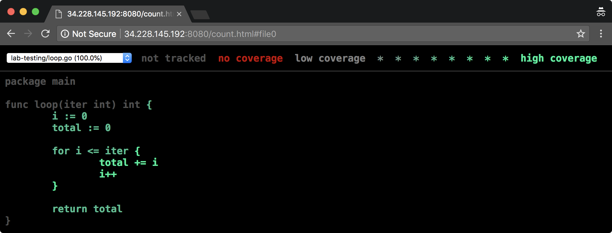
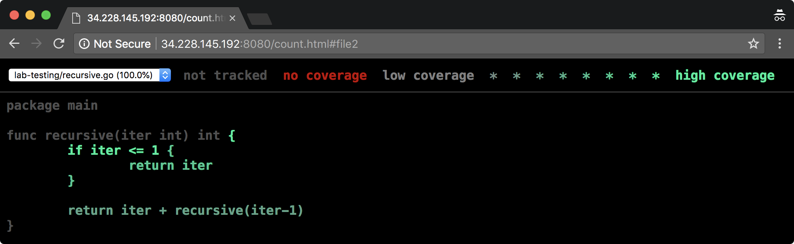
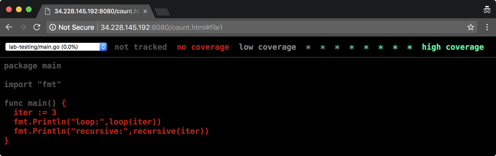

# Go


## Testing

Go provides support for automated testing via the `testing` package. In an effort to simplify testing, Go takes a very streamlined approach when it comes to testing functionality it provides. In a nutshell, they authors of Go hope you choose to build testing abstractions as you need them, versus hiding potentially useful details. Over time, patterns of usage, contributed libraries, and other familiar test constructs have become available if you are familiar with testing in another language. In this lab, we will focus on the built in functionality provided by Go.


### 1. Sample Application

Before diving into details, we will create our application we will test against. This application will allow us to exercise the basic test functionality such as unit tests, code coverage, and benchmarking. Our program will execute two different functions that calculate the same result. The first function, called `loop()` will use iteration to calculate a total; the second function, called `recursive()` will use recursion to calculate a total. We will compare the two methods and confirm they equate the same result value.

```
~$ mkdir -p $(go env GOPATH)/src/lab-testing && cd $_

~/go/src/lab-testing$
```

Create the `loop()` function:

```go
~/go/src/lab-testing$ cat loop.go

package main

func loop(iter int) int {
	i := 0
	total := 0

	for i <= iter {
		total += i
		i++
	}

	return total
}

~/go/src/lab-testing$
```

Create the `recursive()` function:

```go
~/go/src/lab-testing$ cat recursive.go

package main

func recursive(iter int) int {
	if iter <= 1 {
		return iter
	}

	return iter + recursive(iter-1)
}

~/go/src/lab-testing$
```

Create the `main()` function:

```go
~/go/src/lab-testing$ cat main.go

package main

import "fmt"

func main() {
	iter := 3
	fmt.Println("loop:", loop(iter))
	fmt.Println("recursive:", recursive(iter))
}

~/go/src/lab-testing$
```

Lets make sure everything works.

Run program:

```
~/go/src/lab-testing$ go run main.go loop.go recursive.go

loop: 6
recursive: 6

~/go/src/lab-testing$
```

Success, each solution takes the same input (3), specified in the `main.go`, and calculate the correct (and matching) output of 6.

Looping versus recursion is a great way to understand how you code affects your performance. We won't go into details here, but if your interested, just search "looping vs recursion" in your favorite search engine.  


### 2. Test

Now that we have our sample application lets see what Go has to offer regarding testing. In the same directory, lets create a test for our `loop()` function.

```go
~/go/src/lab-testing$ cat loop_test.go

package main

import "testing"

func TestLoop(t *testing.T) {
	t.Skip("todo")
}

~/go/src/lab-testing$
```

Lets run the test, without and with '-v' (verbose) flag.:

```
~/go/src/lab-testing$ go test loop_test.go 

ok  	command-line-arguments	0.002s

~/go/src/lab-testing$ go test -v loop_test.go

=== RUN   TestLoop
    loop_test.go:6: todo
--- SKIP: TestLoop (0.00s)
PASS
ok  	command-line-arguments	0.003s

~/go/src/lab-testing$
```

Take a moment and review the code. We have several items to discuss:

* Test file naming (ex. loop_test.go)
* Importing package `testing`
* Function signature (ex. func TestLoop(t \*testing.T) )
* Test function argument types (ex. testing.T)
* Test functions (ex. Skip())
* `go test` usage

When creating Go tests, we create a same name file with a `\_test.go` extension. This code will be in the same package as the code you are testing. In our example, the package is `main`. These test files `\*\_test.go` are ignored when doing normal builds.

To gain access to the testing automation our tests import the `testing` package. This package provides a variety of functions and types that we use to specify tests and results. The `go test` command is scanning for these files and related `testing` package code.

There are general categories of tests functionality provided by Go. In our previous example we see a function called `TestLoop(..)`.  

The available categories are:

* tests
* benchmarks
* examples

When writing tests, we prefix our function with "Test". When writing benchmark code (more on this later) we prefix it with "Benchmark". Example is similar to the others with "Example" (more on this later).

We see our function is prefixed with Test, so it is a test type function. This type of function requires the argument `*testing.T`. The struct `testing.T` provides a way to manage test state and log format. 

A Test function is finished when you call any of the following methods against `t *testing.T`:

* FailNow - FailNow marks the function as having failed and stops its execution. Execution will continue at the next test or benchmark
* Fatal - Fatal is equivalent to Log followed by FailNow
* FatalF - FatalF is equivalent to Logf followed by FailNow
* SkipNow - SkipNow marks the test as having been skipped and stops its execution
* Skip - Skip is equivalent to Log followed by SkipNow
* Skipf - Skipf is equivalent to Logf followed by SkipNow

Related to the previous methods:

* Log - Record text to log file, only if test fails or `-test.v` flag is set
* Logf - Similar to Log, adds a newline

There are many more functions available, including `parallel` to run tests in parallel and `run` which runs a subtest to the current test.

* Review https://pkg.go.dev/testing

In our example we called `t.Skip("")` to indicate we haven't written our test.  Lets write our first test to check for a correct value.  

Remove the Skip and replace with the following:

```go
~/go/src/lab-testing$ cat loop_test.go

package main

import "testing"

func TestLoop(t *testing.T) {
	result := loop(3)

	if result != 6 {
		t.Errorf("loop(%q) == %q, want %q", 3, result, 3)
	}
}

~/go/src/lab-testing$
```

Run the test:

```
~/go/src/lab-testing$ go test -v loop.go loop_test.go

=== RUN   TestLoop
--- PASS: TestLoop (0.00s)
PASS
ok  	command-line-arguments	0.004s

~/go/src/lab-testing$
```

While its nice our single happy path test work, in Go we use 'table driven design' to set up many tests to really catch those errors. Lets add some more scenarios and loop over them.

```go
~/go/src/lab-testing$ cat loop_test.go

package main

import "testing"

func TestLoop(t *testing.T) {
	cases := []struct {
		in   int
		want int
	}{
		{-1, 1},
		{3, 6},
		{0, 0},
	}

	for _, c := range cases {
		got := loop(c.in)

		if got != c.want {
			t.Errorf("loop(%d) == %d, want %d", c.in, got, c.want)
		}
	}
}

~/go/src/lab-testing$
```

Run the test again:

```
~/go/src/lab-testing$ go test -v loop.go loop_test.go

=== RUN   TestLoop
    loop_test.go:19: loop(-1) == 0, want 1
--- FAIL: TestLoop (0.00s)
FAIL
FAIL	command-line-arguments	0.002s
FAIL

~/go/src/lab-testing$
```

* Correct the test by fixing the incorrect input value.
* Create `recursive_test.go` and run similar tests as `loop_test.go`

The result of a test is PASS or Fail.


### 3. Tool Help

Now that we have a basic idea on how to create a test, take a few minutes and read the help menus for the tool itself
and related concepts.

* `go help test` - main test runner
* `go help testflag` - args to test subcommand and resultant testing binary
* `go help testfunc` - details test,bench,example
* `go test -h` - general help

Example of test flag to render results as json.

```
~/go/src/lab-testing$ go test -v loop.go loop_test.go -json

{"Time":"2022-02-03T20:13:48.271925103Z","Action":"run","Package":"command-line-arguments","Test":"TestLoop"}
{"Time":"2022-02-03T20:13:48.272075649Z","Action":"output","Package":"command-line-arguments","Test":"TestLoop","Output":"=== RUN   TestLoop\n"}
{"Time":"2022-02-03T20:13:48.272091803Z","Action":"output","Package":"command-line-arguments","Test":"TestLoop","Output":"    loop_test.go:19: loop(-1) == 0, want 1\n"}
{"Time":"2022-02-03T20:13:48.272105426Z","Action":"output","Package":"command-line-arguments","Test":"TestLoop","Output":"--- FAIL: TestLoop (0.00s)\n"}
{"Time":"2022-02-03T20:13:48.272114754Z","Action":"fail","Package":"command-line-arguments","Test":"TestLoop","Elapsed":0}
{"Time":"2022-02-03T20:13:48.272125456Z","Action":"output","Package":"command-line-arguments","Output":"FAIL\n"}
{"Time":"2022-02-03T20:13:48.272406977Z","Action":"output","Package":"command-line-arguments","Output":"FAIL\tcommand-line-arguments\t0.002s\n"}
{"Time":"2022-02-03T20:13:48.272428783Z","Action":"fail","Package":"command-line-arguments","Elapsed":0.002}

~/go/src/lab-testing$
```


### 4. Benchmark

Lets create a benchmark test for our loop logic. Append a benchmark test using the *Benchmark* prefix.

```go
~/go/src/lab-testing$ cat loop_test.go

package main

import (
	"testing"
)

func TestLoop(t *testing.T) {
	cases := []struct {
		in   int
		want int
	}{
		{1, 1},
		{3, 6},
		{0, 0},
	}
	for _, c := range cases {
		got := loop(c.in)
		if got != c.want {
			t.Errorf("loop(%d) == %d, want %d", c.in, got, c.want)
		}
	}
}

func BenchmarkLoop(b *testing.B) {
	for i := 0; i < b.N; i++ {
		loop(1000)
	}
}

~/go/src/lab-testing$
```

To run a benchmark, you must tell it which benchmark to run. This prevents us from the default behavior of just running all them all the time. You inform the test tool with a regex to match function signatures. For now, we match all functions labeled *Bench\**.

```
~/go/src/lab-testing$ go test -bench=. loop.go loop_test.go

goos: linux
goarch: amd64
cpu: Intel(R) Xeon(R) Platinum 8175M CPU @ 2.50GHz
BenchmarkLoop-2   	 1688212	       658.3 ns/op
PASS
ok  	command-line-arguments	1.836s

~/go/src/lab-testing$
```

Our code uses `b.N` to set the number of times to loop over our code. The test driver (`go test`) sets this value as best it can to assist creation of useful statistic. Our results show us that the loop was executed 5,000,000 times at an average of 305 nanoseconds per execution.

The *PASS* is the results of your tests (ex. BenchmarkX).

* Create a benchmark for the `recursion()` method
* Run the benchmark again for both `loop()` and `recursion()`

```
~/go/src/lab-testing$ go test -bench=. loop.go loop_test.go recursive.go recursive_test.go -json

{"Time":"2022-02-03T20:17:22.735397895Z","Action":"run","Package":"command-line-arguments","Test":"TestLoop"}
{"Time":"2022-02-03T20:17:22.735519538Z","Action":"output","Package":"command-line-arguments","Test":"TestLoop","Output":"=== RUN   TestLoop\n"}
{"Time":"2022-02-03T20:17:22.735541157Z","Action":"output","Package":"command-line-arguments","Test":"TestLoop","Output":"--- PASS: TestLoop (0.00s)\n"}
{"Time":"2022-02-03T20:17:22.735623806Z","Action":"pass","Package":"command-line-arguments","Test":"TestLoop","Elapsed":0}
{"Time":"2022-02-03T20:17:22.735636364Z","Action":"run","Package":"command-line-arguments","Test":"TestRecursive"}
{"Time":"2022-02-03T20:17:22.735648332Z","Action":"output","Package":"command-line-arguments","Test":"TestRecursive","Output":"=== RUN   TestRecursive\n"}
{"Time":"2022-02-03T20:17:22.735663058Z","Action":"output","Package":"command-line-arguments","Test":"TestRecursive","Output":"--- PASS: TestRecursive (0.00s)\n"}
{"Time":"2022-02-03T20:17:22.73674122Z","Action":"output","Package":"command-line-arguments","Test":"TestRecursive","Output":"goos: linux\n"}
{"Time":"2022-02-03T20:17:22.736763225Z","Action":"output","Package":"command-line-arguments","Test":"TestRecursive","Output":"goarch: amd64\n"}
{"Time":"2022-02-03T20:17:22.736854116Z","Action":"output","Package":"command-line-arguments","Test":"TestRecursive","Output":"cpu: Intel(R) Xeon(R) Platinum 8175M CPU @ 2.50GHz\n"}
{"Time":"2022-02-03T20:17:22.736915562Z","Action":"output","Package":"command-line-arguments","Test":"TestRecursive","Output":"BenchmarkLoop\n"}
{"Time":"2022-02-03T20:17:24.181909567Z","Action":"output","Package":"command-line-arguments","Test":"TestRecursive","Output":"BenchmarkLoop-2        \t"}
{"Time":"2022-02-03T20:17:24.182020307Z","Action":"output","Package":"command-line-arguments","Test":"TestRecursive","Output":" 3164587\t       333.3 ns/op\n"}
{"Time":"2022-02-03T20:17:24.18203567Z","Action":"output","Package":"command-line-arguments","Test":"TestRecursive","Output":"BenchmarkRecursive\n"}
{"Time":"2022-02-03T20:17:25.393399868Z","Action":"output","Package":"command-line-arguments","Test":"TestRecursive","Output":"BenchmarkRecursive-2   \t  615072\t      1935 ns/op\n"}
{"Time":"2022-02-03T20:17:25.393450842Z","Action":"pass","Package":"command-line-arguments","Test":"TestRecursive","Elapsed":0}
{"Time":"2022-02-03T20:17:25.393463237Z","Action":"output","Package":"command-line-arguments","Output":"PASS\n"}
{"Time":"2022-02-03T20:17:25.393885114Z","Action":"output","Package":"command-line-arguments","Output":"ok  \tcommand-line-arguments\t2.660s\n"}
{"Time":"2022-02-03T20:17:25.393948388Z","Action":"pass","Package":"command-line-arguments","Elapsed":2.66}

~/go/src/lab-testing$
```

As you can see, the `recursive()` call is much slower than then the `loop()` call.  

- Why is the recursive call slower?


### 5. Example

We have now seen Test and Benchmark, the final functional area is called Example. When you add examples to your `*_test.go` files, it will be used in the generated documentation.

```go
~/go/src/lab-testing$ cat loop_test.go

package main

import (
	"testing"
	"fmt"
)

func TestLoop(t *testing.T) {
	cases := []struct {
		in   int
		want int
	}{
		{1, 1},
		{3, 6},
		{0, 0},
	}
	for _, c := range cases {
		got := loop(c.in)
		if got != c.want {
			t.Errorf("loop(%d) == %d, want %d", c.in, got, c.want)
		}
	}
}

func BenchmarkLoop(b *testing.B) {
	for i := 0; i < b.N; i++ {
		loop(1000)
	}
}

func ExampleFLoop() {
	fmt.Println(loop(3))
	// Output: 6
}

~/go/src/lab-testing$
```

In our case however, we are using the "main" package, so we can't simply generate non-package level documentation there. For now though, we can see our tests run along with view examples.

```
~/go/src/lab-testing$ go test -v loop.go recursive.go loop_test.go recursive_test.go 

=== RUN   TestLoop
--- PASS: TestLoop (0.00s)
=== RUN   TestRecursive
--- PASS: TestRecursive (0.00s)
=== RUN   ExampleFLoop
--- PASS: ExampleFLoop (0.00s)
PASS
ok  	command-line-arguments	0.003s

~/go/src/lab-testing$
```

* Change the Output comment to say 7 and rerun the test, what happened?


### 6. Coverage

Another area of concern for testing, aside from correctness and speed is how much of our code is actually being used. In general, 100% code coverage is hard to achieve. Even if we can't hit 100%, we can get a feel for the most used and least used (hot/cold) areas of our code, allowing us to focus on correctness, speed, and other features.

Lets generate the coverage by counting the times lines are executed.

```
~/go/src/lab-testing$ go test -coverprofile=cover.out *.go

ok  	command-line-arguments	0.002s	coverage: 75.0% of statements

~/go/src/lab-testing$
```

The flag *-coverprofile* writes our coverage data to `cover.out`. In the previous case, we simply checked if statements were used at least once. We can also count by using the `-covermode=count` flag and value.

```
~/go/src/lab-testing$ cat ./cover.out 

mode: set
/home/ubuntu/go/src/lab-testing/loop.go:3.25,7.16 3 1
/home/ubuntu/go/src/lab-testing/loop.go:12.2,12.14 1 1
/home/ubuntu/go/src/lab-testing/loop.go:7.16,10.3 2 1
/home/ubuntu/go/src/lab-testing/main.go:5.13,9.2 3 0
/home/ubuntu/go/src/lab-testing/recursive.go:3.30,4.15 1 1
/home/ubuntu/go/src/lab-testing/recursive.go:8.2,8.33 1 1
/home/ubuntu/go/src/lab-testing/recursive.go:4.15,6.3 1 1

~/go/src/lab-testing$ go test -coverprofile=count.out -covermode=count *.go

ok  	command-line-arguments	0.003s	coverage: 75.0% of statements

~/go/src/lab-testing$
```

```
~/go/src/lab-testing$ diff -y count.out cover.out

mode: count						      |	mode: set
/home/ubuntu/go/src/lab-testing/loop.go:3.25,7.16 3 4	      |	/home/ubuntu/go/src/lab-testing/loop.go:3.25,7.16 3 1
/home/ubuntu/go/src/lab-testing/loop.go:12.2,12.14 1 4	      |	/home/ubuntu/go/src/lab-testing/loop.go:12.2,12.14 1 1
/home/ubuntu/go/src/lab-testing/loop.go:7.16,10.3 2 11	      |	/home/ubuntu/go/src/lab-testing/loop.go:7.16,10.3 2 1
/home/ubuntu/go/src/lab-testing/main.go:5.13,9.2 3 0		/home/ubuntu/go/src/lab-testing/main.go:5.13,9.2 3 0
/home/ubuntu/go/src/lab-testing/recursive.go:3.30,4.15 1 5    |	/home/ubuntu/go/src/lab-testing/recursive.go:3.30,4.15 1 1
/home/ubuntu/go/src/lab-testing/recursive.go:8.2,8.33 1 2     |	/home/ubuntu/go/src/lab-testing/recursive.go:8.2,8.33 1 1
/home/ubuntu/go/src/lab-testing/recursive.go:4.15,6.3 1 3     |	/home/ubuntu/go/src/lab-testing/recursive.go:4.15,6.3 1 1

~/go/src/lab-testing$
```

We can then view the results as HTML via:

```
~/go/src/lab-testing$ go tool cover -html=count.out -o count.html

~/go/src/lab-testing$ cat count.html | head

<!DOCTYPE html>
<html>
	<head>
		<meta http-equiv="Content-Type" content="text/html; charset=utf-8">
		<title>lab-testing: Go Coverage Report</title>
		<style>
			body {
				background: black;
				color: rgb(80, 80, 80);

~/go/src/lab-testing$
```

If you are not running locally, you can copy the file to your laptop (ex. via scp). Or, try to serve up the html via Go itself!

```go
~/context$~/go/src/lab-tests$ cat web.go

package main

import (
	"net/http"
)

func main() {
	http.Handle("/", http.FileServer(http.Dir("./")))
	http.ListenAndServe(":8080", nil)
}

~/context$~/go/src/lab-tests$
```

```
~/context$~/go/src/lab-tests$ go run web.go
...
```

Open <ip>:8080 in your browser to your IP on port 8080!





Given we executed this in the context of testing, it seems correct our driver was not covered.


### 7. TDD and BDD via Go

As mentioned earlier, Go tries to keep things simple. This simplification comes at a price. TDD usually falls in the realm of developers while BDD wants to move the testing away from the developer level and more towards business rules via a DSL. Since Go does not provide a BDD DSL, others have stepped in. One popular library is https://github.com/onsi/ginkgo.

If you are unfamiliar with BDD DSL, here is an example from `gingko`.

```
...
Describe("the strings package", func() {
  Context("strings.Contains()", func() {
    When("the string contains the substring in the middle", func() {
      It("returns `true`", func() {
        Expect(strings.Contains("Ginkgo is awesome", "is")).To(BeTrue())
      })
    })
  })
})
...
```

The critical thing to notice is the more English like DSL versus what the TDD code looks like.

If time permits, try to install one and run an example.


### 8. Challenge

Pick any program that you wrote for a lab and write a short test for it. Verify that the test runs.


### 9. GoMock and Test Doubles (aka Imposters)

In this section, we take a look at test doubles and try mocking via GoMock, a popular mocking framework for Go.

Per Gerard Meszaros (xunit):

> A Test Double is a type of object that is much more cooperative and let us us write tests the way we want to.

He goes further and enumerates the following test doubles.

* test double - we replace a component on which the SUT depends with a "test-specific equivalent."
* hard-coded test double - build the test double by hard-coding the return values and/or expected calls
* test spy - use a test double to capture the indirect output calls made to another component by the SUT for later verification by the test
* test-specific subclass - add methodsthat expose the state or behavior needed by the test to a subclass of the SUT
* mock object - replace an object the SUT depends on with a test-specific object that verifies it is being used correctly by the SUT
* configurable test double - configure a reusable test double with the values to be returned or verified during the fixture setup phase of a test
* test stub - we replace a real object with a test-specifc object that feeds the desired indirect inputs into the system under test
* fake object - replace a component that the SUT depends on with a much lighter-weight implementation

> nb. SUT means system under test
> nb. fixture is a fixed sttate of a set of objects used as a baseline for running tests (junit 4 definition)

As we can see, there are potentially many ways to configure our tests. With that in mind, lets take GoMock for a spin.

We begin with creating a new project. This project ultimately will have an interface (that we want to mock), an 
implementation of that interface, and a driver program using them. Create the following module and install the related
GoMock packages.

```
$ mkdir ~/myapp ; cd ~/myapp

~/myapp$ go mod init example.com/user/myapp

~/myapp$ go install github.com/golang/mock/mockgen@latest

...

~/myapp$ go get github.com/golang/mock/mockgen/model

...

~/myapp$ export PATH=$HOME/go/bin:$PATH

~/myapp$ cat go.mod 

module example.com/user/myapp

go 1.18

require github.com/golang/mock v1.6.0 // indirect

~/myapp$
```

Part of the reason for tools like GoMock are to reduce errors by generating our mocks. This is accomplished with mockgen.

```
~/myapp$ mockgen -h

mockgen has two modes of operation: source and reflect.

Source mode generates mock interfaces from a source file.
It is enabled by using the -source flag. Other flags that
may be useful in this mode are -imports and -aux_files.
Example:
	mockgen -source=foo.go [other options]

Reflect mode generates mock interfaces by building a program
that uses reflection to understand interfaces. It is enabled
by passing two non-flag arguments: an import path, and a
comma-separated list of symbols.
Example:
	mockgen database/sql/driver Conn,Driver

  -aux_files string
    	(source mode) Comma-separated pkg=path pairs of auxiliary Go source files.
  -build_flags string
    	(reflect mode) Additional flags for go build.
  -copyright_file string
    	Copyright file used to add copyright header
  -debug_parser
    	Print out parser results only.
  -destination string
    	Output file; defaults to stdout.
  -exec_only string
    	(reflect mode) If set, execute this reflection program.
  -imports string
    	(source mode) Comma-separated name=path pairs of explicit imports to use.
  -mock_names string
    	Comma-separated interfaceName=mockName pairs of explicit mock names to use. Mock names default to 'Mock'+ interfaceName suffix.
  -package string
    	Package of the generated code; defaults to the package of the input with a 'mock_' prefix.
  -prog_only
    	(reflect mode) Only generate the reflection program; write it to stdout and exit.
  -self_package string
    	The full package import path for the generated code. The purpose of this flag is to prevent import cycles in the generated code by trying to include its own package. This can happen if the mock's package is set to one of its inputs (usually the main one) and the output is stdio so mockgen cannot detect the final output package. Setting this flag will then tell mockgen which import to exclude.
  -source string
    	(source mode) Input Go source file; enables source mode.
  -version
    	Print version.
  -write_package_comment
    	Writes package documentation comment (godoc) if true. (default true)

~/myapp$
```

"mockgen" has different modes of operating (source, reflection), we will use source mode (where you provide the source to
analyze). Next, we create our interface, this contains the functions we ultimately want to test via mocking.

```
~/myapp$ mkdir ./doer

~/myapp$ cat ./doer/doer.go 

package doer

type Doer interface {
	DoSomething(int, string) error
}

~/myapp$
```

Your project should look as follows.

```
~/myapp$ tree .
.
├── doer
│   └── doer.go
├── go.mod
└── go.sum

1 directory, 3 files

~/myapp$
```

We have now arrived at generating our mock. We supply where to store physically (destination), how to relate logicially
(package), what is the input (source) to inspect; including specifying anything specifically inside that file (Doer), 
versus all things in the file. Run mockgen and review the output.

```
~/myapp$ mockgen -destination=mocks/mock_doer.go -package=mocks example.com/user/myapp/doer Doer

~/myapp$ tree .
.
├── doer
│   └── doer.go
├── go.mod
├── go.sum
└── mocks
    └── mock_doer.go

2 directories, 4 files

~/myapp$ go doc -all mocks/mock_doer.go

package mocks // import "example.com/user/myapp/mocks"

Package mocks is a generated GoMock package.

TYPES

type MockDoer struct {
	// Has unexported fields.
}
    MockDoer is a mock of Doer interface.

func NewMockDoer(ctrl *gomock.Controller) *MockDoer
    NewMockDoer creates a new mock instance.

func (m *MockDoer) DoSomething(arg0 int, arg1 string) error
    DoSomething mocks base method.

func (m *MockDoer) EXPECT() *MockDoerMockRecorder
    EXPECT returns an object that allows the caller to indicate expected use.

type MockDoerMockRecorder struct {
	// Has unexported fields.
}
    MockDoerMockRecorder is the mock recorder for MockDoer.

func (mr *MockDoerMockRecorder) DoSomething(arg0, arg1 interface{}) *gomock.Call
    DoSomething indicates an expected call of DoSomething.

~/myapp$
```

Next we create a consumer of our interface called User.

```
~/myapp$ mkdir ./user

~/myapp$ cat ./user/user.go

package user

import "example.com/user/myapp/doer"

type User struct {
	Doer doer.Doer
}

func (u *User) Use() error {
	return u.Doer.DoSomething(7, "Hello GoMock")
}

~/myapp$
```

With an interface and implementation, we now make the driver application that uses them.

```
~/myapp$ cat app.go   

package main

import (
	"example.com/user/myapp/user"

	"errors"
	"fmt"
	"strings"
)

type Operator struct{}

func (o Operator) DoSomething(i int, s string) error {
	if i < 0 {
		return errors.New("invalid count")
	}
	fmt.Println(strings.Repeat(s+"\n", i))
	return nil
}

func main() {
	u := user.User{Operator{}}
	u.Use()
}

~/myapp$
```

Next we run the program to make sure it works, this doesn't use GoMock in anyway.

```
~/myapp$ go run app.go

Hello GoMock
Hello GoMock
Hello GoMock
Hello GoMock
Hello GoMock
Hello GoMock
Hello GoMock

~/myapp$
```

To use GoMock, we need to write a test!

```
~/myapp$ cat ./user/user_test.go 

package user_test

import (
  "example.com/user/myapp/mocks"
  "example.com/user/myapp/user"

  "testing"
  "github.com/golang/mock/gomock"
)

func TestUse(t *testing.T) {
    mockCtrl := gomock.NewController(t)
    defer mockCtrl.Finish()

    mockDoer := mocks.NewMockDoer(mockCtrl)
    testUser := &user.User{Doer:mockDoer}

    // Expect Do to be called once with 7 and "Hello GoMock" as parameters, and return nil from the mocked call.
    mockDoer.EXPECT().DoSomething(7, "Hello GoMock").Return(nil).Times(1)

    testUser.Use()
}

~/myapp$
```

There is a lot going on in a short space. At a high level, we are telling GoMock how to intercept and evaluate calling 
our Doer interface. This particular test says our User triggering DoSomething should pass in the args 7 and "Hello GoMock",
return nothing, and only be called a single time. Run the test.

```
~/myapp$ go test -count=1 -v example.com/user/myapp/user

=== RUN   TestUse
--- PASS: TestUse (0.00s)
PASS
ok  	example.com/user/myapp/user	0.002s

~/myapp$
```

At this point your application will look as follows.

```
~/myapp$ tree .
.
├── app.go
├── doer
│   └── doer.go
├── go.mod
├── go.sum
├── mocks
│   └── mock_doer.go
└── user
    ├── user.go
    └── user_test.go

3 directories, 7 files

~/myapp$
```

While the above is only meant to get you started, there is much more to learn about pros and cons of mocking (or not 
mocking).

Try breaking our test!

* `mockDoer.EXPECT().DoSomething(8, "Hello GoMock").Return(nil).Times(1)`
or
* `mockDoer.EXPECT().DoSomething(7, "Hello GoMock").Return(nil).Times(2)`

The above example was inspired by the very good post here https://blog.codecentric.de/en/2017/08/gomock-tutorial/.


### 10. Conclusion

This concludes our introduction into Golang testing. Other areas of interest include:

* sub-testing (nested and directly runnable tests), parallism, proper benchmarks
* mocking (or not-mocking https://github.com/golang/mock, https://github.com/vektra/mockery)
* moving tests into seperate package (improves seperation by removing direct backdoors to non-exported items)
* fuzzing support https://go.dev/doc/fuzz/
* fixtures (preconditions for tests)
* golden files (ease testing complex output)

Furthermore, here is an interesting blog post detailing code coverage and Go https://go.dev/blog/cover.

<br>

Congratulations you have completed the lab.

<br>

